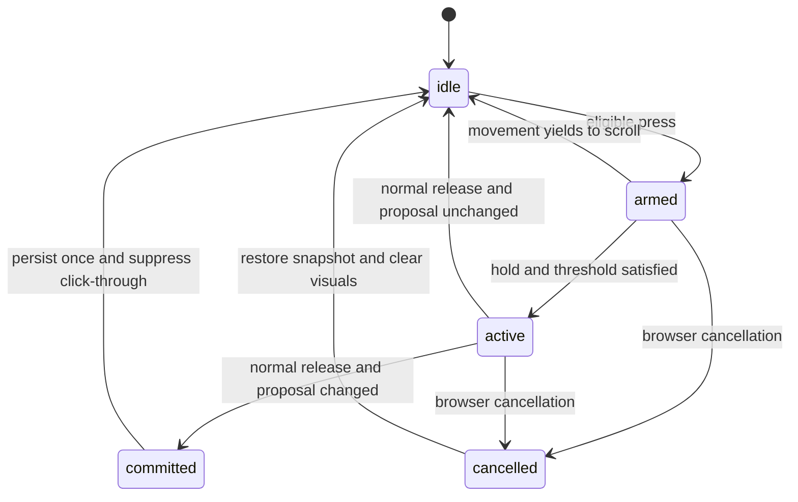
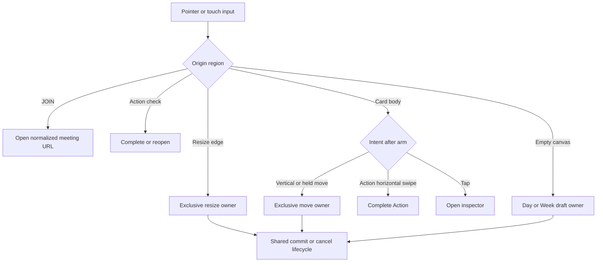

# Calendar Interaction Regression Remediation - Plan

## Goal Capsule

- **Objective:** Restore reliable navigation, card manipulation, cancellation, stable field-scoped Event and Action editing, existing Action checklist editing, Week behavior, and responsive interaction quality without changing the app's established visual language or healthy flows.
- **Authority order:** Product Requirements and Key Decisions in this plan; Key Technical Decisions; current domain invariants in `src/features/planner/timelineGesture.js`; existing repository conventions.
- **Execution profile:** Characterization-first repair against the latest `main`. Every regression test must be observed failing for the intended reason before its fix is accepted.
- **Baseline:** The forensic findings were verified against `origin/main` at `9deff64`. Revalidate the affected seams if `main` advances before implementation.
- **Stop conditions:** Stop and request product direction if a fix requires changing Action completion semantics, modal morph behavior, recurrence/data shape, or Week Action parity beyond this plan.
- **Tail ownership:** The implementing engineer owns code, tests, visual comparison, real-device QA, preview deployment, and the final merge readiness report.

---

## Product Contract

### Summary

Repair the regressions as one interaction-system correction rather than a series of local propagation guards. The destination behavior is explicit: Actions contains no calendar context ribbon, returning calendar views restore the selected day before paint, every advertised gesture has one owner, cancellation never commits, short Events remain resizable, and Week cards preserve scroll and direct meeting access.

### Problem Frame

Changes after the `cd70d57` comparison point introduced or exposed several independent contract failures. The virtualized date ribbon now survives in state while its DOM node is unmounted, so returning from Actions can remount an off-screen selection. Timeline interactions also mix native listeners, React delegation, stream listeners, card capture, and document fallbacks without one ownership model. The result is silent competition between move, resize, swipe, click, and cancellation paths.

The existing browser suite remains green because several assertions inspect container visibility or handler presence instead of user-visible geometry and persisted state. The repair must therefore improve both implementation boundaries and the test oracle.

### Key Decisions

- **Actions is a calendar-context-free destination.** The Week ribbon and Month grid are absent, not hidden or animated closed. Returning to Timeline or Agenda restores the selected date in view. (session-settled: user-directed — chosen over collapsing the ribbon in Actions: the ribbon is not part of that page.) Governs R1, R2.
- **Repair contract drift without redesigning healthy surfaces.** Existing completion, modal, planning, JOIN, and lane-packing behavior remains unchanged. (session-settled: user-approved — chosen over a broad polish rewrite: the audit isolated specific ownership and lifecycle defects.) Governs R11.

### Requirements

**Navigation and ribbon lifecycle**

- R1. Actions must mount no Week ribbon, Month grid, or other calendar-context surface at any zoom.
- R2. Returning from Actions to Timeline or Agenda must preserve the selected date and place its ribbon cell inside the visible strip on the first painted frame.
- R3. Rapid view changes must cancel stale ribbon scrolling or reveal work and must never leave a blank ribbon slot.

**Gesture ownership and cancellation**

- R4. Each pointer or touch sequence must have exactly one active owner for its full lifecycle.
- R5. `pointercancel` and `touchcancel` must restore pre-gesture state without persistence, toast, composer opening, click-through, or lifted visuals.
- R6. Empty Day and Week space must require the established 500 ms hold, and movement beyond the shared threshold must yield to scrolling.

**Timed Event behavior**

- R7. Every timed Event from the 10-minute floor upward must expose reachable start and end resize targets at ordinary and compact timeline scales.
- R8. Event body input must still open or move the Event, JOIN must still open the meeting directly, and pre-lift touch movement must still permit vertical scrolling.

**Scheduled Action behavior**

- R9. The checkmark toggles complete and reopen, the body opens or moves and may swipe right to complete, and the bottom edge resizes an estimated Action without triggering body or swipe behavior.
- R10. Action completion must retain the opaque persistent COMPLETE overlay, haptic preference behavior, compact checkmark, and current drag elevation.
- R17. Editing an existing open Action must show Add a Step immediately as the first checklist control, including when the Action has no subtasks; visibility must not depend on another click, checklist length, or a state-changing re-render.

**Event and Action inspector editing**

- R18. Activating an inline field in an Event or Action inspector must open only that field's editor; at most one inline field may be expanded at a time.
- R19. Inline editor opening, switching, saving, reverting, and closing must not remount or replay the sheet morph, expand unrelated controls, or produce an overshooting layout bounce; reduced motion must preserve the same state transitions without animation.

**Week, focus, and responsive quality**

- R11. Week Event cards must permit vertical scrolling before lift, move after a valid hold, cancel without mutation, and expose direct JOIN when a meeting URL exists.
- R12. Manual timeline focus from the toggle or `F` must remain until manually restored; automatic focus changes may respond only to an active user scroll session.
- R13. Timeline Event cards must be keyboard reachable, interactive regions must remain semantically separate, and coarse-pointer targets must remain at least 44 by 44 CSS pixels without moving positioned content.
- R14. Critical controls and labels must remain readable, non-overlapping, and hit-testable at 320, 390, 639, 640, 1023, 1024, and 1280 CSS-pixel widths.

**Regression protection**

- R15. The repair must preserve the current modal morph, Day and Agenda JOIN routing, completion overlay and haptics, PLAN TODAY review, Find a Slot variety, simultaneous-event lane packing, and Actions-column collapse.
- R16. Tests for each repaired regression must assert visible geometry or persisted outcome and must be proven by a deliberate negative control.

### Acceptance Examples

- AE1. Given Actions is open from Day, Week, or Month, when the page renders, then no ribbon or Month grid exists in the accessibility or layout tree. Covers R1.
- AE2. Given a future selected date, when the user goes Timeline to Actions to Agenda, then the same date remains selected and its cell is horizontally inside the ribbon before the first screenshot. Covers R2, R3.
- AE3. Given a 15-minute Event at compact mobile scale, when the user drags either edge, then only the corresponding boundary changes and a body tap still opens details. Covers R7, R8.
- AE4. Given an estimated Action, when a drag begins from its bottom edge, then estimate changes, status remains open, and start time does not move. Covers R4, R9.
- AE5. Given an active Event or Action drag, when the browser dispatches cancellation, then storage is byte-equivalent for the affected record and no completion UI, composer, or toast appears. Covers R5.
- AE6. Given a Week Event with a meeting URL, when the user activates JOIN, then the normalized meeting URL opens and the Event inspector remains closed. Covers R8, R11.
- AE7. Given manual focus is enabled, when the user scrolls away from midnight or a programmatic layout scroll occurs, then focus remains enabled until the user toggles it. Covers R12.
- AE8. Given a 320-pixel viewport, when the user activates the top view pills, ribbon controls, focus toggle, JOIN, Action checkmark, and navigation rail, then the pointer resolves to the intended control and no critical labels overlap. Covers R13, R14.
- AE9. Given an existing open Action with no checklist items, when the user opens it and enters editing, then Add a Step is already visible as the first checklist row and accepts a new step without any intermediate click. Covers R17.
- AE10. Given an Action inspector in its reading state, when the user activates Due, then only the Due editor opens, Reminder and planning rows remain in their reading faces, and the sheet does not replay its entrance. Covers R18, R19.
- AE11. Given an Event inspector in its reading state, when the user activates Reminder and then Date, then Reminder closes as Date opens, the draft retains the prior reminder choice, and no unrelated field expands. Covers R18, R19.

### Success Criteria

- The selected ribbon cell is inside the visible strip in 100% of the navigation matrix across desktop and mobile test viewports.
- Event edge resize passes for 10, 15, 30, 45, and 60 minutes at ordinary and compact scales on mouse and touch paths.
- Every cancellation scenario produces zero persisted record changes and zero post-gesture side effects.
- No test can pass by checking only container visibility when the user-visible child may be off-screen or covered.
- Existing open Actions with zero or many subtasks show Add a Step first as soon as editing begins, and a newly added step persists without hiding the composer.
- Event and Action inspectors maintain one active inline editor, preserve draft values while switching fields, and show no sheet remount or non-monotonic bounce.
- The full unit, production build, browser, visual, and real-hardware gates pass with no unexplained regression in R15.

### Scope Boundaries

**In scope**

- Day Event move and two-edge resize.
- Day Action move, bottom-edge estimate resize, check toggle, and body swipe completion.
- Existing Action checklist editing and Add a Step ordering in both the inspector and full-screen Actions surface.
- Field-scoped inline editing and transition stability in existing Event and Action inspectors.
- Day and Week empty-space hold-to-create cancellation safety.
- Week Event move, scroll, cancellation, and direct JOIN.
- Actions page composition, ribbon remount positioning, focus-source behavior, keyboard access, and breakpoint quality.

**Deferred to follow-up work**

- Week Action move, resize, or swipe parity. Week Actions must not display affordances that imply unsupported behavior.
- Extracting the full Day or Week timeline from `src/Planner.jsx` into a new component tree.
- Reworking the wider application animation system, theme system, or navigation visual design.

**Outside this plan**

- Calendar data models, recurrence logic, persistence format, sync, authentication, backend work, or native Expo migration.
- New Action completion effects, new modal morph concepts, or changes to planning workflows.

### Sources and Research

- `.planning/debug/calendar-ui-regression-audit.md` contains the reproduced symptoms, causal evidence, and eliminated hypotheses.
- `.planning/plans/2026-08-13-calendar-ui-regression-remediation.md` contains the prior audit-derived remediation outline and preserved healthy-flow list.
- `DESIGN.md` defines coarse-pointer targets, material, motion, and negative-control expectations, but its interaction and easing guidance needs the update in U1.
- `src/features/planner/timelineGesture.js` owns current snapping, duration floors, lift delays, touch-intent classification, and pure move/resize proposals.

---

## Planning Contract

### Key Technical Decisions

- KTD1. **Use an explicit interaction lifecycle and exclusive owner.** Represent a sequence as `idle`, `armed`, `active`, then `committed` or `cancelled`; record surface, input type, origin region, and owner. This replaces layered propagation patches and governs R4-R6.
- KTD2. **Separate commit from cancellation.** Normal release may persist a changed proposal. Cancellation only restores the before snapshot and clears transient state. Governs R5.
- KTD3. **Make Action controls sibling regions.** The body, completion control, and resize edge must not be nested interactive elements or share native and delegated ownership. Governs R9, R10, R13.
- KTD4. **Separate Event visuals from Event hit targets.** Keep card content clipped, but expose duration-independent logical edge zones in the lane; nearest-edge resolution handles geometries too short for two visible grips. Governs R7, R8.
- KTD5. **Unmount calendar context in Actions and re-anchor before paint.** The ribbon remains absent in Actions. A newly mounted strip is treated as unpositioned and synchronously reveals the selected date before paint. Governs R1-R3.
- KTD6. **Model focus intent by source and bounded session.** Focus tracks `manual` or `auto`; user scroll intent expires at gesture or momentum end instead of remaining as a sticky boolean. Governs R12.
- KTD7. **Use observable outcomes as test oracles.** Browser coverage asserts geometry, hit target, new-page URL, storage mutation, and rendered state. Every new regression assertion must be observed failing under the old behavior or an intentional inversion. Governs R14-R16.
- KTD8. **Prefer seam extraction over a Planner rewrite.** Add a small pure interaction-state module and keep rendering changes local to existing surfaces. A broad `Planner.jsx` decomposition is deferred because it increases rollback and visual-regression risk without being necessary for these repairs.
- KTD9. **Render Add a Step from explicit editability, not checklist shape.** The existing Action inspector places the composer before checklist rows as soon as editing starts, while the full-screen open Action keeps its inline composer visible. Neither surface may use checklist length or a later unrelated re-render as the visibility trigger. Governs R17.
- KTD10. **Separate draft transaction state from active-field state.** `detailEditing` may continue to represent an inspector draft with Save/Revert, but a separate field key owns the one inline editor that is expanded. Activating a row begins or continues the draft and changes only that key; sheet presence and entrance motion remain untouched. Governs R18, R19.

### High-Level Technical Design

Ribbon restoration follows a separate lifecycle: leaving a calendar view removes the calendar-context subtree in Actions; returning mounts a new strip node; layout positioning aligns the selected date; only then may optional user-facing scrolling resume. DOM node identity, view mode, selected date, and virtual window changes all invalidate the positioned marker.

### System-Wide Impact

- **State:** No persisted schema changes. Interaction state is transient and must not leak into notebook serialization.
- **Input:** Day and Week mouse/touch paths converge on one lifecycle but retain surface-specific coordinate conversion.
- **Accessibility:** Interactive regions become siblings with unique names and focus behavior; no anchor or button may be nested inside another button.
- **Motion:** Existing modal and completion motion stays unchanged. Gesture cancellation removes transient elevation without an exit flourish, and ribbon restoration must avoid visible corrective jumps.
- **Testing:** Playwright helpers gain reusable geometry, hit-testing, cancellation, and persistence-snapshot oracles.

### Risks and Mitigations

- **Risk:** Pointer capture changes can fix desktop while breaking touch scrolling. **Mitigation:** keep pre-lift touch behavior compatible with `pan-y` and test real scroll movement from card and edge origins.
- **Risk:** Expanded resize targets can steal body taps or JOIN. **Mitigation:** make logical regions non-overlapping and assert `elementFromPoint` plus real activation at compact geometry.
- **Risk:** Pre-paint ribbon alignment can fight virtual-window shifts or stale smooth scroll callbacks. **Mitigation:** invalidate by strip-node identity and view mode, cancel stale animation work, and assert first-frame child geometry.
- **Risk:** Shared cancellation code can accidentally suppress legitimate normal releases. **Mitigation:** unit-test all lifecycle transitions and preserve one integration test for each Event, Action, and draft owner.
- **Risk:** The current working branch differs from audited `origin/main`. **Mitigation:** begin implementation from the latest `main`, re-run the red characterization cases before editing, and resolve drift by behavior rather than copying line-based patches.

### Sequencing

U1 locks the interaction contract and test vocabulary. U2 establishes the lifecycle seam. U3 can then repair navigation independently, while U4 and U5 apply exclusive ownership to Actions and Events. U8 repairs existing Action checklist editing, and U9 separates inspector draft state from field expansion. U6 brings Week and focus paths onto the shared rules. U7 closes keyboard and responsive gaps after geometry stabilizes.

---

## Implementation Units

### U1. Lock interaction contracts and browser oracles

- **Goal:** Make the intended behavior and reusable user-visible assertions explicit before handler changes.
- **Requirements:** R1-R16; KTD7.
- **Dependencies:** None.
- **Files:**
  - Modify `DESIGN.md`.
  - Create `docs/interaction-contracts/planner-interactions.md`.
  - Modify `tests/e2e/helpers.js`.
- **Approach:**
  1. Update `DESIGN.md` with the current no-overshoot navigation easing, sheet reveal rule, Actions-page composition, one-owner rule, and cancel-is-never-commit rule.
  2. Put the region ownership matrix, lifecycle terminology, field-scoped inspector rule, and Add a Step ordering in the focused interaction contract so future UI work does not infer behavior from handlers.
  3. Add helpers that assert horizontal and vertical containment, resolve `elementFromPoint`, snapshot one persisted record, and dispatch pointer/touch cancellation consistently.
  4. Keep helpers assertion-focused; do not hide the interaction action or expected outcome behind an opaque all-in-one fixture.
- **Patterns to follow:** `tests/e2e/helpers.js` uses direct state setup and polling instead of arbitrary persistence sleeps; `DESIGN.md` records non-negotiables with explicit failure history.
- **Test scenarios:** Test expectation: none — this unit defines documentation and shared test infrastructure; feature-bearing units consume the helpers and prove them through negative controls.
- **Verification:** A reviewer can map every physical region to one owner and one cancel outcome. The helper API can express all AE1-AE8 without relying on CSS class presence alone.

### U2. Introduce the shared interaction lifecycle and cancellation path

- **Goal:** Give Day Event, Day draft, and reusable future owners one explicit state machine with distinct commit and cancel outcomes.
- **Requirements:** R4-R6, R16; KTD1, KTD2, KTD8.
- **Dependencies:** U1.
- **Files:**
  - Create `src/features/planner/timelineInteractionState.js`.
  - Create `src/features/planner/timelineInteractionState.test.js`.
  - Modify `src/features/planner/timelineGesture.js`.
  - Modify `src/features/planner/timelineGesture.test.js`.
  - Modify `src/Planner.jsx`.
  - Modify `tests/e2e/timeline-gestures.spec.js`.
  - Modify `tests/e2e/timeline-touch.spec.js`.
- **Approach:**
  1. Keep coordinate arithmetic in `timelineGesture.js`; put lifecycle, owner, origin, before snapshot, proposal, and click suppression in the new pure module.
  2. Route Day Event and empty-space draft arm, activation, release, and cancellation through the lifecycle.
  3. Persist only on normal release when `gestureChangedAnything` is true.
  4. Apply the movement that crosses activation in the activation frame so a one-move resize is not lost.
  5. Keep document listeners only as a fallback for an externally owned active sequence; they must not become a second owner.
- **Execution note:** Begin with lifecycle transition tests and browser cancellation cases that fail against the existing shared finish path.
- **Patterns to follow:** Pure proposal functions and immutable before/after comparisons in `src/features/planner/timelineGesture.js`.
- **Test scenarios:**
  1. An armed press cancelled before lift returns to idle, suppresses the following click, and creates no draft.
  2. An active Event move cancelled after visible movement restores the original date, start, and duration in memory and storage.
  3. Active start-edge and end-edge resizes cancelled after movement restore their exact original boundaries.
  4. A normal release with no proposal change produces no write, undo entry, or toast.
  5. A normal release with a changed proposal commits exactly once even when a document fallback also observes release.
  6. The first movement beyond activation updates the proposal in that same frame.
  7. A slow timeline scroll followed by a finger rest never matures into empty-space creation.
- **Verification:** Pure tests cover every lifecycle transition. Day cancellation E2E tests observe unchanged stored records and cleared transient UI.

### U3. Restore Actions-page and ribbon mount lifecycle

- **Goal:** Keep Actions free of calendar context and make the selected date visible immediately when Timeline or Agenda returns.
- **Requirements:** R1-R3, R14-R16; KTD5, KTD7.
- **Dependencies:** U1.
- **Files:**
  - Modify `src/Planner.jsx`.
  - Modify `tests/e2e/actions.spec.js`.
  - Modify `tests/e2e/shell.spec.js`.
  - Modify `tests/e2e/navigation-shell.spec.js`.
  - Modify `tests/e2e/helpers.js`.
- **Approach:**
  1. Keep the calendar-context subtree conditionally absent in Actions for Day, Week, and Month zoom.
  2. Treat a new ribbon strip node as unpositioned even when virtual window state remains valid.
  3. Reconcile the selected date with the virtual render window, then place the selected cell inside the visible strip in layout timing before paint.
  4. Invalidate positioning when view mode, strip node, selected date, zoom, or virtual window identity changes.
  5. Cancel stale smooth-scroll or reveal callbacks during rapid Timeline, Actions, and Agenda transitions.
  6. Do not animate a ribbon collapse into Actions; page-level transition continuity may remain, but no hidden ribbon geometry may reserve space.
- **Execution note:** Add the full route and viewport matrix first; confirm the current implementation fails because the selected child is off-screen even though the container is visible.
- **Patterns to follow:** Existing virtual window shifting and selected-cell reveal helpers in `src/Planner.jsx`; child containment helper from U1.
- **Test scenarios:**
  1. Covers AE1. Actions contains no ribbon or Month grid after entry from each zoom.
  2. Covers AE2. Timeline to Actions to Timeline preserves the date and reveals the selected cell at 390 and 1280 widths.
  3. Timeline to Actions to Agenda and the reverse Agenda route meet the same first-frame geometry contract.
  4. A date near either virtual range edge remains selected and reachable after the round trip.
  5. Rapid Timeline, Actions, Agenda, Timeline switching leaves one visible selected cell and no blank 93-pixel slot.
  6. Manual ribbon arrow and cell navigation remain unbounded in both temporal directions after remount.
- **Verification:** Every route asserts selected-cell bounds against strip bounds, not only ribbon-container visibility. Screenshots show no corrective jump after the first frame.

### U4. Give Action body, checkmark, and resize edge exclusive ownership

- **Goal:** Make all scheduled Action interactions reliable and mutually exclusive while preserving completion feedback.
- **Requirements:** R4, R5, R9, R10, R13, R15, R16; KTD1-KTD3, KTD7.
- **Dependencies:** U1, U2.
- **Files:**
  - Modify `src/features/planner/TimelineActionCard.jsx`.
  - Modify `src/Planner.jsx`.
  - Modify `src/features/planner/timelineGesture.js`.
  - Modify `src/features/planner/timelineGesture.test.js`.
  - Modify `src/index.css` only if the sibling regions need tokenized hit-area styling.
  - Modify `tests/e2e/actions.spec.js`.
  - Modify `tests/e2e/timeline-touch.spec.js`.
- **Approach:**
  1. Render the body, completion control, and bottom resize edge as sibling interactive regions inside one non-interactive lane wrapper.
  2. Bind pointer capture or native ownership only to the region that owns the sequence; remove the native-body versus delegated-child race.
  3. Permit horizontal completion only when the origin is the Action body.
  4. Route bottom-edge input only to estimate resize, including horizontal drift after activation.
  5. Preserve the existing opaque persistent COMPLETE overlay, reversible check, haptic call, compact mark, swipe backdrop, and lifted-card geometry.
  6. Use lifecycle cancellation from U2 and suppress the release click after every armed or active non-tap sequence.
- **Execution note:** Prove each region independently with mouse and touch tests before changing the component tree.
- **Patterns to follow:** The sibling row/JOIN pattern in `RowWithJoin`; completion state and haptic tests already present in `tests/e2e/actions.spec.js`.
- **Test scenarios:**
  1. Covers AE4. Desktop bottom-edge drag changes estimate, keeps start time, and does not open or move the Action.
  2. Touch bottom-edge vertical drag changes estimate while status remains open.
  3. Horizontal drift from the resize edge never completes the Action.
  4. Deliberate right swipe from the body completes; a partial swipe returns to rest without status change.
  5. The checkmark completes and reopens without opening details or starting a drag.
  6. Cancellation during body move, resize, or swipe restores the original record and overlay position.
  7. Completed cards retain an opaque COMPLETE overlay after persistence and reload; haptics fire only when enabled.
  8. `elementFromPoint` at the center of each region resolves to the intended sibling control.
- **Verification:** The Action matrix passes on desktop and 390-pixel touch emulation. A deliberate owner inversion makes the relevant test fail.

### U8. Restore step-first editing for existing Actions

- **Goal:** Make Add a Step immediately visible and first in the checklist section whenever an existing open Action is edited, including an empty checklist.
- **Requirements:** R15, R17; KTD9.
- **Dependencies:** U1.
- **Files:**
  - Modify `src/Planner.jsx`.
  - Modify `tests/e2e/actions.spec.js`.
  - Modify `tests/e2e/composer.spec.js` only if shared inspector setup belongs there.
- **Approach:**
  1. In the existing Action inspector, render the Add a Step composer before mapped checklist rows as soon as edit mode is active.
  2. Derive visibility from Action editability, not checklist length, focus state, or an unrelated field update.
  3. Keep the full-screen open Action composer visible for an empty checklist and align its order with the inspector.
  4. Preserve immediate structural writes for add, remove, promote, and toggle operations so Revert does not claim to undo changes it does not own.
  5. Keep the composer mounted after a successful add, clear only its value, and place the new step in the existing checklist order.
- **Execution note:** Reproduce the zero-subtask inspector path first and observe that the new test fails before changing render order or visibility.
- **Patterns to follow:** Existing immediate `addSub` behavior and `InlineAdd`/`SubComposer` controls in `src/Planner.jsx`; seeded Action fixtures in `tests/e2e/actions.spec.js`.
- **Test scenarios:**
  1. Covers AE9. An existing open Action with no steps shows Add a Step first immediately after Edit Action is activated.
  2. The field is visible without focusing or changing the title, note, status, planning state, or another inspector control.
  3. An existing Action with multiple steps still renders Add a Step before the first checklist row.
  4. Pressing Enter with a non-empty value adds one persisted step, clears the input, and leaves the composer visible first.
  5. Blank or whitespace-only submission creates no step and leaves inspector state unchanged.
  6. Opening the same Action from the full-screen Actions view, Day timeline, and Agenda reaches the same inspector contract.
  7. The full-screen open Action card with zero steps continues to show its inline Add a Step field without first opening the inspector.
- **Verification:** The zero-step and populated-step inspector tests pass on first render after edit activation and after reload. DOM order confirms the composer precedes checklist rows.

### U9. Isolate inline field editing in Event and Action inspectors

- **Goal:** Open one intended inline editor without expanding every editable field or replaying the sheet transition.
- **Requirements:** R15, R18, R19; KTD10.
- **Dependencies:** U1, U8.
- **Files:**
  - Modify `src/Planner.jsx`.
  - Modify `tests/e2e/composer.spec.js`.
  - Modify `tests/e2e/motion.spec.js`.
  - Modify `tests/e2e/actions.spec.js`.
- **Approach:**
  1. Keep the inspector draft transaction and header Save/Revert state separate from the active inline field key.
  2. Give each Action and Event field a stable key such as planning, due, reminder, date, start, duration, repeat, calendar, or category.
  3. Activating a field starts or continues the draft and expands only that field; activating another field closes the prior editor while preserving draft values.
  4. Make the header Edit action enter draft mode without expanding all controls. Rows stay in their reading faces until individually activated.
  5. Clear the active key on Save, Revert, inspector close, record change, and sheet exit completion.
  6. Animate only the selected row's reveal with the existing restrained no-overshoot motion token. Do not key, remount, scale, or replay the containing sheet.
  7. Under reduced motion, apply the same field-state change immediately and retain focus management.
- **Execution note:** Characterize Action Due and Reminder plus Event Date and Reminder before changing the global edit flag branches; include DOM node identity and sampled geometry in the failure evidence.
- **Patterns to follow:** `Reveal` for local grid-row expansion; `usePresence` and `Sheet` for persistent exit handling; `FluidEditActions` for draft Save/Revert without owning individual row expansion.
- **Test scenarios:**
  1. Covers AE10. Activating Action Due exposes only the Due date control and leaves Reminder, planning, reward, list, category, and dependency rows collapsed.
  2. Activating Action Reminder closes Due, opens only Reminder, and preserves an unsaved Due draft value.
  3. Covers AE11. Event Reminder followed by Event Date keeps one editor open and preserves the reminder draft.
  4. Activating Event start or duration does not reveal recurrence, calendar, category, alert, location, link, or note editors.
  5. The header Edit Event or Edit Action action does not fan out field controls; Add a Step follows U8.
  6. Save commits all draft changes once and clears the active field; Revert restores the record and clears it; close follows the existing dirty-draft contract.
  7. The sheet DOM node and origin geometry remain stable while a row opens. Height samples move monotonically with no overshoot or entrance-animation restart.
  8. Keyboard activation focuses the selected control, Escape closes or abandons that field according to the existing inline control contract, and focus returns to its row.
  9. Reduced-motion mode exposes only the selected editor with no transition delay and identical Save/Revert semantics.
- **Verification:** Action and Event field matrices pass in normal and reduced-motion modes. The sheet remains mounted, unrelated fields stay in reading state, and the motion test observes no bounce or second entrance.

### U5. Make Event resize targets independent of rendered duration

- **Goal:** Allow both-edge resize for every valid Event without stealing body, JOIN, or scroll input.
- **Requirements:** R4, R5, R7, R8, R13, R15, R16; KTD1, KTD2, KTD4, KTD7.
- **Dependencies:** U1, U2.
- **Files:**
  - Modify `src/Planner.jsx`.
  - Modify `src/features/planner/timelineGesture.test.js`.
  - Modify `tests/e2e/timeline-gestures.spec.js`.
  - Modify `tests/e2e/timeline-touch.spec.js`.
  - Modify `tests/e2e/join.spec.js`.
- **Approach:**
  1. Remove height gates that determine whether logical resize edges exist.
  2. Keep title, time, and JOIN clipped inside the visual card while the lane exposes non-layout-changing edge hit regions.
  3. For very short cards, resolve resize intent by nearest edge after hold rather than stacking two controls over the entire body.
  4. Keep the center body region available for open or move and keep JOIN outside the body gesture owner.
  5. Preserve the 10-minute floor, five-minute snapping, end-preserving start resize, and start-preserving end resize.
  6. Permit `pan-y` before lift on touch and abort the arm once scroll intent wins.
- **Execution note:** Build the duration and scale matrix as a failing characterization before replacing the pixel gates.
- **Patterns to follow:** Pure floor and proposal functions in `src/features/planner/timelineGesture.js`; direct JOIN sibling behavior verified in existing Day and Agenda tests.
- **Test scenarios:**
  1. Covers AE3. Start and end edges work for 10, 15, 30, 45, and 60-minute Events at ordinary scale.
  2. The same duration matrix works at compact mobile hour height.
  3. A body tap on each short Event opens details and does not resize.
  4. A body hold moves the Event while preserving duration.
  5. A touch scroll beginning on the card center or near an edge changes timeline scroll and does not mutate the Event.
  6. JOIN opens the meeting directly for a short Event and never starts move or resize.
  7. Start-edge and end-edge cancellation restore original persisted boundaries.
  8. Overlapping Event lane packing and narrow-card title retention remain unchanged.
- **Verification:** All matrix cells pass with geometry and storage assertions. No arbitrary rendered-height threshold controls whether an Event is resizable.

### U6. Align Week interaction and focus intent with the shared contracts

- **Goal:** Restore Week scrolling and JOIN, route Week cancellation safely, and prevent stale scroll intent from changing focus.
- **Requirements:** R4-R6, R8, R11, R12, R15, R16; KTD1, KTD2, KTD6, KTD7.
- **Dependencies:** U1, U2, U3.
- **Files:**
  - Modify `src/Planner.jsx`.
  - Modify `src/features/planner/timelineInteractionState.js`.
  - Modify `src/features/planner/timelineInteractionState.test.js`.
  - Modify `tests/e2e/week-drag.spec.js`.
  - Modify `tests/e2e/join.spec.js`.
  - Modify `tests/e2e/timeline-polish.spec.js`.
  - Modify `tests/e2e/actions.spec.js` if focus behavior is currently covered there.
- **Approach:**
  1. Allow Week Event cards to participate in vertical panning before lift; movement beyond the shared threshold cancels the hold.
  2. Route Week Event move and Week empty-draft creation through the same lifecycle semantics while retaining Week-specific day and time projection.
  3. Add a sibling Week JOIN target that normalizes the URL and never nests inside the Event button.
  4. Keep Week Action behavior as open-only in this plan and remove any affordance that implies unsupported move, resize, or swipe behavior.
  5. Replace the sticky user-scroll ref with a bounded wheel or touch session that expires after end or momentum timeout.
  6. Track focus source as manual or automatic. Only active user scroll may drive automatic collapse or near-midnight restoration.
- **Execution note:** Add Week scroll-from-card, Week cancellation, Week JOIN, and manual-focus tests before modifying `touchAction` or scroll state.
- **Patterns to follow:** `RowWithJoin` for valid sibling controls; Week projection arithmetic already in `src/Planner.jsx`; lifecycle from U2.
- **Test scenarios:**
  1. A vertical touch beginning on a Week Event changes scroll position without moving the Event.
  2. A stationary hold followed by a cross-day move updates date and time once.
  3. Week Event and Week draft cancellation produce no storage mutation, composer, toast, or lifted residue.
  4. Covers AE6. Week JOIN opens the normalized meeting URL in a new page and leaves the inspector closed.
  5. A Week Event with no meeting URL exposes no JOIN target.
  6. Covers AE7. Manual focus survives user and programmatic scrolling until toggle or `F` restores it.
  7. Automatic focus collapses only during an active user scroll away from midnight and restores only near midnight in that same intent model.
  8. Timeline to Actions still removes the ribbon without playing a collapse animation, and returning follows U3.
- **Verification:** Week scroll, move, create, cancel, and JOIN pass on desktop and 390-pixel touch emulation. Focus-source unit and E2E matrices pass without timing-dependent sleeps as the only oracle.

### U7. Close keyboard and breakpoint interaction gaps

- **Goal:** Make the repaired controls usable and readable across keyboard, coarse pointer, and breakpoint-edge layouts.
- **Requirements:** R13-R16; KTD3, KTD4, KTD7.
- **Dependencies:** U3-U6, U8, U9.
- **Files:**
  - Modify `src/Planner.jsx`.
  - Modify `src/features/planner/TimelineActionCard.jsx` only if final semantics require adjustment.
  - Modify `src/index.css`.
  - Modify `tests/e2e/accessibility-quality.spec.js`.
  - Modify `tests/e2e/mobile.spec.js`.
  - Modify `tests/e2e/shell.spec.js`.
  - Modify `tests/e2e/actions.spec.js`.
  - Modify `tests/e2e/join.spec.js`.
- **Approach:**
  1. Make Day Event bodies keyboard reachable with Enter and Space behavior guarded from JOIN and resize regions.
  2. Preserve unique accessible names and prohibit nested interactive elements on Day, Week, Agenda, and Action cards.
  3. Reduce mobile gesture-hint competition by stacking its copy and actions or presenting a one-line dismissible summary.
  4. Validate header labels, view pills, ribbon controls, focus toggle, JOIN, Action checkmark, navigation rail, and Actions controls at every required width.
  5. Preserve the existing positioned-element exception when extending coarse-pointer targets so target sizing cannot alter absolute, fixed, or sticky geometry.
- **Execution note:** Capture bounding boxes and hit-test results before styling so each responsive change has a concrete failing oracle.
- **Patterns to follow:** Coarse-pointer non-negotiables in `DESIGN.md`; existing accessibility coverage in `tests/e2e/accessibility-quality.spec.js`; narrow month-header coverage in `tests/e2e/shell.spec.js`.
- **Test scenarios:**
  1. Enter and Space on a focused Day Event body open details exactly once.
  2. Keyboard activation of JOIN opens the meeting and does not open details.
  3. No Event, Action, Agenda, or Week card contains nested buttons or anchors.
  4. Covers AE8. Each critical control is non-overlapping and receives a real click at 320, 390, 639, 640, 1023, 1024, and 1280 widths.
  5. All coarse-pointer control targets measure at least 44 by 44 CSS pixels without changing their lane or header geometry.
  6. Month and Week labels remain readable and do not collide with the Timeline, Agenda, and Actions pills.
  7. The mobile gesture hint no longer compresses copy and two controls into three competing columns and does not materially reduce timeline height after dismissal.
- **Verification:** Keyboard, semantic, geometry, and real-hit tests pass at all breakpoint edges. Contact-sheet comparison shows no new text clipping, overlap, or timeline-width regression.

---

## Verification Contract

| Gate | Command or activity | Covers | Pass signal |
|---|---|---|---|
| Pure behavior | `npm test` | U2, U4-U6 | All Node tests pass, including every lifecycle state and gesture proposal boundary. |
| Production compile | `npm run build` | U2-U7 | Build succeeds with no new warning beyond the existing bundle-size warning. |
| Focused navigation, Actions, and inspectors | `npm run test:e2e -- tests/e2e/actions.spec.js tests/e2e/composer.spec.js tests/e2e/motion.spec.js tests/e2e/shell.spec.js tests/e2e/navigation-shell.spec.js` | U3, U6-U9 | Actions composition, step-first editing, field-scoped inspector motion, and first-frame selected-cell geometry pass at desktop and mobile sizes. |
| Focused gestures | `npm run test:e2e -- tests/e2e/timeline-gestures.spec.js tests/e2e/timeline-touch.spec.js tests/e2e/week-drag.spec.js` | U2, U4-U6 | Move, resize, swipe, create, scroll, and cancellation matrices pass with persisted-state assertions. |
| JOIN and accessibility | `npm run test:e2e -- tests/e2e/join.spec.js tests/e2e/accessibility-quality.spec.js tests/e2e/mobile.spec.js` | U4-U7 | Direct meeting routing, semantics, target size, and responsive hit tests pass. |
| Full browser suite | `npm run test:e2e` | R1-R16 | Entire production-preview suite passes without retries masking a deterministic failure. |
| Full automated gate | `npm run test:all` | R1-R16 | Unit and E2E suites pass in one clean run. |
| Visual comparison | `node scripts/contact-sheet.mjs --out audit/contact-sheet-before` before changes and `node scripts/contact-sheet.mjs --out audit/contact-sheet-after` after changes | U3-U7 | Human comparison across all themes and standard widths shows no new clipping, overlap, contrast, or motion discontinuity. |
| Real hardware | Manual Samsung phone, Windows laptop, and MacBook matrix | R1-R16 | Slow-scroll rest, short Event resize, Action move/resize/swipe/check, cancellation, view round trips, Week scroll/JOIN, keyboard, and modal flows all behave as specified. |
| Deployed preview | Repeat the Samsung smoke matrix against the preview artifact | R1-R16 | Deployed behavior matches local production preview with zero uncaught errors or React warnings. |

For each newly added regression scenario, record the negative control in the PR evidence: the assertion failed against the old behavior or a deliberate inversion, and the failure named the intended user-visible contract.

---

## Definition of Done

- R1-R19 and AE1-AE11 are satisfied on the latest `main` baseline.
- U1-U9 are implemented in dependency order, with each feature-bearing unit landing its own tests.
- No physical input sequence can activate two owners, and every cancellation path is non-mutating.
- The selected ribbon day is visible on the first frame after every Actions round trip at all tested zooms and viewports.
- Short Event and scheduled Action gesture matrices pass on mouse and touch.
- Existing Actions show Add a Step first on edit with empty and populated checklists, without an unrelated click or re-render.
- Event and Action inspectors expand one field at a time and never replay or bounce the containing sheet when Due, Reminder, date, time, recurrence, or another inline field is activated.
- Week scrolling, Event movement, draft creation, cancellation, and direct JOIN pass without introducing unsupported Week Action affordances.
- All preserved behaviors in R15 have targeted green coverage and a manual smoke result.
- Unit, build, focused E2E, full E2E, visual comparison, real-hardware, and deployed-preview gates pass.
- Console output contains no new uncaught exception, React warning, or duplicate persistence signal.
- `DESIGN.md` and `docs/interaction-contracts/planner-interactions.md` match the shipped behavior.
- The final diff contains no abandoned experiments, temporary diagnostics, screenshots, generated contact sheets, or unrelated refactors.
