# feat: Editor field variety and a morph that arrives with its shape

Refinements to surfaces that already exist. None invents product behaviour; all are
about rhythm and timing.

**Product Contract preservation:** not applicable — no upstream brainstorm. This plan
is `ce-plan-bootstrap` and owns its own requirements.

---

## Goal Capsule

The Event and Action editors read as a column of identical rounded rectangles, and the
composer's content is still arriving 1176ms into a 480ms morph. Fix the rhythm of the
first and cut the tail off the second, using only material the app already has.

A third finding — desktop's `+ ADD` never morphed at all — was **delivered by Codex in
`8f2eac8`** while this plan was being written. It is recorded here as U2 for traceability
and needs no work.

**Baseline:** `55bafaa`. This plan was drafted against `99491e2` and rebased onto the five
Codex commits that landed after it; every line reference below is against `55bafaa`.

---

## Problem Frame

### The editors

Both editors already have the reference image's good bones — a centred hero
(title / time range / date, `Planner.jsx:5670-5698`), a two-up figure row
(LENGTH · STARTS for events, REWARD · STEPS for actions, `Planner.jsx:5707-5726`),
and a countdown footer (`Planner.jsx:5813-5817`). Those match the reference's
"Picnic / 9:00–10:00" header, its "13 min · 30°" tiles and its "8 DAYS, 7 HOURS"
footer respectively.

The monotony is one specific band: the attribute rows between the figures and the
footer. Every row is full width, every row is the same height, and every row wears
the same `CARD_R` fill. Eight of them in a row for an event:

| # | Event row | Source | Content length |
|---|---|---|---|
| 1 | Category | `InlineChoice` 5731 | short enum |
| 2 | All day / At a time | `InlineChoice` 5738 | short enum |
| 3 | THROUGH (all-day only) | `InlineField` 5746 | short date |
| 4 | Repeats | `InlineChoice` 5763 | short enum |
| 5 | Reminder | `InlineChoice` 5772 | can be long |
| 6 | Place | `InlineField` 5783 | free text |
| 7 | Meeting link | `InlineField` 5788 | free text + JOIN |
| 8 | Note | inline `div` 5806 | multiline |

Four of those carry a single short enum and are given the same full width as a
multiline note. The reference solves exactly this by pairing the short ones
two-up ("Home" beside "Busy"), filling the identity field with accent, and
reserving full width for content that is genuinely long.

**The two editors also do not share a row system.** Events use `InlineChoice`
(`7601`) and `InlineField` (`8228`) — each row its own filled card at `CARD_R`.
Actions use `DetailRow` (`7504`) and `InlineChoiceRow` (`8157`) — no fill, a
`borderBottom` hairline, grouped in one container. Two parallel primitives doing
one job, which is why the two modals look unlike each other while each is
internally flat.

### The composer's arrival

Measured in Chromium at 1280×860 and 390×844, sampling per frame across a real
press (`--fluid-*` geometry, `data-fluid-origin`, computed opacity):

| Surface | `origin` | panel opacity | content opacity |
|---|---|---|---|
| NEW, desktop | `notch` | **1.00 throughout** | 0.00 at t=573ms, 0.30 at t=622ms |
| NEW, mobile | `notch` | **1.00 throughout** | 0.00 at t=549ms, 0.30 at t=624ms |
| NEW close, both | `notch` | **1.00 throughout** | 1.00 → 0.00 by t≈110ms |
| `+ ADD`, desktop | **`trigger`** | 1.00 | **1.00 from frame 1** |

Three findings:

1. **The panel never fades.** `nbnotchin` holds `opacity: 1` and the measurement
   confirms it. The container morph is correct and is not what needs fixing.
2. **The content does.** `nbnotchgroupin` (`4430`) fades each of eight groups from
   `opacity: 0`, delayed `--nb-morph-lead + n × --nb-morph-step`. With
   `MORPH_MS 480`, `LEAD .35`, `STEP .2`, `FADE .5`, group 8 starts at 936ms and
   finishes at **1176ms** — two and a half times the length of the shape it is
   supposed to belong to. On close, `4447` fades the whole body out in ~110ms.
   Content fading in slowly and out all at once is what reads as "a fade in and a
   fade out" on top of the morph.
3. **Desktop's `+ ADD` never morphs.** `onAddTask` (`3975`) is
   `setComposer({ kind: "task" })` — no `notch`, no `morphSource` — so it resolves
   to `morph: "auto"` and `data-fluid-origin="trigger"`: no accent wash, no source
   label, and on close it never enters the `closing` stage at all, it just
   disappears. The mobile-only `+ ACTION` button (`5286`) does it correctly.
   `[data-test="new-action"]` is not visible at 1280 — desktop's control is the
   unlabelled `+ ADD` at `6322`.

### A contradiction to settle first

The codebase states both of these:

- `Planner.jsx:4358-4360` — "Fading the body independently made the opening shape
  empty and erased the contents before the closing shape reached its card, so the
  connected morph read as a generic fade."
- `tests/e2e/motion.spec.js:160` — "form content must wait until the physical move
  has established the new space", asserting content opacity `< 0.2` at 40%.

The first forbids what the second requires. This plan resolves it in favour of the
first (see KTD3) and rewrites the assertion to encode the new contract. **The
assertion must be rewritten, not deleted** — see R6.

---

## Requirements

| ID | Requirement |
|---|---|
| R1 | The Event and Action editors share one row primitive rather than two parallel ones. |
| R2 | The attribute band varies: short bounded fields sit two-up; fields with variable-length content keep full width. |
| R3 | A two-up pair collapses to full width when its content would truncate, by flex rule rather than a width breakpoint. |
| R4 | The field that identifies the record (category for an event, status for an action) reads as primary. |
| R5 | Composer content finishes arriving within `MORPH_MS`; no content group outlives the shape it belongs to. |
| R6 | The motion contract tests pin the arrival inside the shape and still fail if the tail regresses. |
| R7 | ~~Desktop's `+ ADD` morphs from its own button~~ — **delivered by Codex in `8f2eac8`**, including the empty-state answer (a dashed panel is not a pill; neutral arrival). |
| R8 | No new network dependency, no new product surface. |

---

## Key Technical Decisions

**KTD1 — One row primitive, card-per-row, with span variants.**
`(session-settled: user-directed — chosen over unifying on grouped divider rows, and over keeping both systems: the card look is what the reference uses, and it carries a two-up variant more naturally than a hairline-divided group.)`
The surviving primitive is the `InlineChoice`/`InlineField` shape (own fill, `CARD_R`).
`DetailRow`/`InlineChoiceRow` are folded into it. Governs R1, R2, R4.

**KTD2 — Re-rhythm existing fields only; no new content blocks.**
`(session-settled: user-directed — chosen over adding a place/map card and attendee avatars: a map needs network tiles, and this app is local-first with no network calls. Events carry a `place` string and have no attendee model.)`
Governs R8.

**KTD3 — The cascade stays; its tail is cut to fit inside the shape.**
`(session-settled: user-directed — revised 2026-08-17 after Codex's `2026-08-17-framer-fidelity-motion.md` rejected deleting the cascade. Chosen over deleting `nbnotchgroupin` outright, and over leaving the timing as it is.)`

The complaint was never the stagger — it was that the stagger outlives the shape. Group 8
starts at 936ms and finishes at **1176ms** against a 480ms morph, so content is still
arriving long after the sheet has settled. Cutting the tail fixes the reported symptom
without removing the mechanism.

`MORPH_LEAD` stays at `.35`, so content still waits for the clip to have somewhere to land
— which is the constraint the reject was defending. `MORPH_STEP` and `MORPH_FADE` come
down until the last group lands inside `MORPH_MS`:

| | lead | step | fade | group 8 starts | group 8 ends |
|---|---|---|---|---|---|
| now | .35 (168ms) | .2 (96ms) | .5 (240ms) | 936ms | **1176ms** |
| target | .35 (168ms) | ~.04 (19ms) | ~.3 (144ms) | ~320ms | **~464ms** |

**A correction this plan owes.** Its first draft cited `Planner.jsx:4358` as stating the
principle behind deleting the cascade. That comment forbids an *independent* body fade
that left the opening shape empty — a narrower point, and not authority for removing a
stagger bound to the same 480ms. Codex's plan and this plan's own design-lens review found
that error independently. `MORPH_MS` stays 480; it is a ceiling, not a target.
Governs R5, R6.

**KTD4 — Pairs collapse by flex, not by media query.**
Two-up rows are a wrapping flex whose children carry a `min-width` basis, so a pair
becomes two full-width rows when the content needs it. A width breakpoint would have
to guess at label lengths that vary by locale and by user data. Consistent with the
fixed→flex direction in `docs/superpowers/plans/2026-08-16-responsive-tiers-and-motion.md`.
Governs R3.

**KTD5 — Keep the accent wash and the source label.**
Only the *content* fade goes. `nbnotchwash` (`4394`) and `nb-morph-source-label`
(`4431`) are what sell "the button became the sheet" and neither is a content
cross-fade. Governs R5.

---

## High-Level Technical Design

### The attribute band, before and after

```
BEFORE — one column, eight identical full-width cards

  ┌──────────── LENGTH ────────────┬──────────── STARTS ────────────┐   figures (exists)
  ├────────────────────────────────┴────────────────────────────────┤
  │ ◑  WORK                                                       ⌄ │   short enum
  │ ◷  At a time                                                  ⌄ │   short enum
  │ ↻  Does not repeat                                            ⌄ │   short enum
  │ ♪  No reminder                                                ⌄ │   can be long
  │ ⌖  Add a place                                                  │   free text
  │ ⚭  Add a meeting link                                    [JOIN]  │   free text
  │ …  Add a note                                                   │   multiline
  └─────────────────────────────────────────────────────────────────┘

AFTER — pairs for bounded enums, full width only where content varies

  ┌──────────── LENGTH ────────────┬──────────── STARTS ────────────┐   figures (exists)
  ├────────────────────────────────┼────────────────────────────────┤
  │ ◑ WORK            (accent)   ⌄ │ ◷ At a time                  ⌄ │   primary | when
  ├────────────────────────────────┼────────────────────────────────┤
  │ ↻ Does not repeat            ⌄ │ ♪ No reminder                ⌄ │   pair, collapses
  ├────────────────────────────────┴────────────────────────────────┤
  │ ⌖  Add a place                                                  │   full: free text
  │ ⚭  Add a meeting link                                    [JOIN]  │   full: free text
  │ …  Add a note                                                   │   full: multiline
  └─────────────────────────────────────────────────────────────────┘
```

The rule that decides the span is content shape, not field count: **a bounded enum
or a single date pairs; free text, a list, and anything multi-value stays full width.**
That is why `Reminder` pairs (its value is one of five chips) but `Place` does not.

### The morph timeline

```mermaid
gantt
    dateFormat SSS
    axisFormat %L
    title Composer open — 480ms morph

    section Now
    clip-path (shape)       :000, 480ms
    accent → card wash      :264, 216ms
    source label holds      :000, 374ms
    content group 1         :168, 240ms
    content group 4         :456, 240ms
    content group 8         :936, 240ms

    section After
    clip-path (shape)       :000, 480ms
    accent → card wash      :264, 216ms
    source label holds      :000, 374ms
    content group 1         :168, 144ms
    content group 4         :225, 144ms
    content group 8         :320, 144ms
```



The stagger survives; the tail does not. Content still waits for the clip to have
somewhere to land, and the whole gesture now ends when the shape does.

---

## Scope Boundaries

**In scope:** the attribute band of both editors, the row primitives behind it, the
composer's content timing, `+ ADD`'s morph wiring, and the motion contract tests.

**Not in scope:** the hero, the figure tiles and the countdown footer — all three
already match the reference and are left alone. The `EventScheduleEditor`, the
checklist, and dependency editing keep their current internals; only their row
wrapper changes.

### Deferred to Follow-Up Work

- `.nb-main`'s `grid-template-columns` is the last measured layout animation in the
  app (noted in the responsive-tiers plan). Not touched here.
- `RIBBON_FALLBACK_CELL_WIDTH` still matches one tier only.
- The 640–1023px tier still has no dedicated treatment.
- `GooeySearch`'s `maxWidth: 48` reveal completes at ~46% of its stated 300ms.

---

## Implementation Units

Motion first: the units are small, independent, and carry the most visible payoff.
The row-primitive refactor is the largest change and lands after the timing is right,
so a regression in either is unambiguous about which unit caused it.

### U1. Cut the cascade's tail so content lands inside the shape

**Goal:** Every content group finishes arriving within `MORPH_MS`, so nothing keeps
changing after the sheet has settled. The stagger itself is kept.

**Requirements:** R5. Implements KTD3.

**Dependencies:** none.

**Files:**
- `src/Planner.jsx` — `MORPH_STEP` (`318`) and `MORPH_FADE` (`319`); `MORPH_LEAD` (`317`)
  and `MORPH_MS` (`305`) are unchanged
- `tests/e2e/motion.spec.js` (timing pinned in U3)

**Approach:**
This is a two-constant change. The derived properties at `4388-4390`
(`--nb-morph-lead/step/fade`) and the group rule at `4426-4427` already compute from them,
so nothing structural moves.

1. Bring `MORPH_STEP` down from `.2` until the eighth group *starts* early enough to
   finish inside the shape. `.04` (19ms per step) puts group 8's start at ~320ms.
2. Bring `MORPH_FADE` down from `.5` to about `.3` (144ms), so group 8 ends at ~464ms —
   just inside `MORPH_MS`.
3. Leave `MORPH_LEAD` at `.35`. That is the beat that makes content wait for the clip to
   have somewhere to land, and it is the part of the mechanism worth defending.
4. Change nothing about `nbnotchgroupin` (`4437`), the `--nb-stage` block (`4426-4427`),
   the wash, the source label, or the closing rules Codex reworked in `3a5d680`.

Derive the final numbers from measurement, not arithmetic alone — the group count is
capped at 8 by the generated block, but a sheet with fewer groups lands sooner, and the
constants must hold for the tallest composer as well as the shortest.

**Execution note:** measure before and after with a per-frame sample of the brightest
group's opacity, the same probe that produced the 1176ms figure. The success condition is
a number, not an impression.

**Patterns to follow:** the constants and their comment block at `305-319` — the existing
comment explains why each fraction exists, and it needs updating alongside the values.

**Test scenarios:**
- The last content group's `delay + duration` is less than or equal to `MORPH_MS`.
- Content is still not fully opaque at 40% of `nbnotchin` — the wait KTD3 preserves.
- The stagger survives: at least three groups, and consecutive delays differ.
- The wash and source-label behaviour are byte-for-byte unchanged.
- Reduced motion still lands `data-morph-stage="open"` with no travel.
- Closing still leads with the content, per `3a5d680`.

**Verification:** the composer is fully readable the moment it stops moving, and nothing
arrives afterwards. Judged at 1280 and 390.

### U2. ~~Give desktop's `+ ADD` the morph it never had~~ — delivered

**Status: shipped by Codex in `8f2eac8`, 2026-08-17.** No work remains.

That commit added `hidingAdd`, `data-test="actions-add"`, `data-morph-source`, the
`tabIndex` and `visibility` treatment, and an `onAddTask(source)` that passes
`notch: true` with a `morphSource`. It also answered this unit's deferred question: the
empty-state dashed panel takes `morph: "none"` rather than morphing from its own bounds,
because a full-width dashed block is not a pill. That is the better answer and it stands.

R7 is satisfied. Verify by regression rather than reimplementation: at 1280, pressing
`+ ADD` gives the sheet `data-fluid-origin="notch"` and a `closing` stage on the way out.

### U3. Pin the arrival inside the shape

**Goal:** The suite gains an upper bound on when content finishes arriving, so the tail
cannot creep back.

**Requirements:** R6.

**Dependencies:** U1.

**Files:**
- `tests/e2e/motion.spec.js` — the existing `nbnotchgroupin` probes at `134-163` and
  `219-258`

**Approach:**
Because U1 keeps the cascade, **no existing assertion is inverted or deleted.** Both
probes still find their animations, `motion.spec.js:160` still holds, and Codex's
constraint is satisfied by construction. This unit only *adds* the bound the suite is
missing — the one that would have caught a 1176ms tail.

The second test already reads `groupDelays` and `groupProps`. Extend that same evaluate to
return each group's `delay + duration`, and assert the maximum is `<= MORPH_MS`. Keep
`groupCount > 2` and the consecutive-delay gap so the stagger is still pinned; the gap
threshold at `253` is currently `> 50` and must come down with `MORPH_STEP`, or it will
fail on the new 19ms step. That threshold change is the one edit to an existing assertion,
and it is a *loosening* forced by U1 — call it out in the diff rather than letting it pass
as a tidy-up.

**Execution note:** this is the assertion the repo did not have. Write it first, watch it
fail against the current `.2`/`.5` constants, then let U1 turn it green. An upper bound
that never saw red is not a bound.

**Test scenarios:**
- The new bound fails against `MORPH_STEP = .2` / `MORPH_FADE = .5` and passes after U1.
- `groupCount > 2` still holds — the stagger was not flattened into one block.
- Consecutive group delays still differ, at the new smaller step.
- `motion.spec.js:160` is untouched and still passes: content is not yet opaque at 40%.
- The layout-property guard at `249-251` still fails if a group animates `width`.

**Verification:** `npx playwright test tests/e2e/motion.spec.js` green, with the new bound
demonstrably red on the pre-U1 constants.

### U4. One row primitive with a span variant

**Goal:** A single field-row component that both editors use, able to render at full
width or as one half of a pair.

**Requirements:** R1, R3. Implements KTD1, KTD4.

**Dependencies:** U1 (so a visual regression here cannot be confused with a timing one).

**Files:**
- `src/Planner.jsx` — `InlineChoice` (`7601`), `InlineField` (`8228`),
  `DetailRow` (`7504`), `InlineChoiceRow` (`8157`)
- `tests/e2e/composer.spec.js`, `tests/e2e/actions.spec.js`

**Approach:**
1. Keep the `InlineChoice`/`InlineField` card shape as the survivor and give both a
   span prop with two values, full and half.
2. Fold `DetailRow` and `InlineChoiceRow` into them. `InlineChoiceRow` is already
   `InlineChoice` minus the fill plus a divider, so the merge is mostly deleting the
   duplicate and passing the fill through; both already share `useLiquidPill`.
3. A half-span row declares a `min-width` basis inside a wrapping flex, so a pair
   becomes two rows when either side would truncate. No breakpoint.
4. Preserve `tint` on both, since U5 uses it for the primary field.

The Action rows currently rely on `divider` for separation inside a group. Once they
carry their own fill they no longer need it; remove the prop rather than leaving a
parameter nothing passes.

**The merge is safe as scoped, verified rather than assumed.** `DetailRow` and
`InlineChoiceRow` have no call sites outside the Action editor block (`5527-5643`), so
neither needs a delegating shim. `onAddTask` likewise has exactly the two call sites U2
names — `6322` and `6428`; the third grep hit at `6266` is `ActionsPanel`'s prop
destructuring, not a call. Re-run both checks before deleting anything, since this plan
may be executed after other work has landed.

**Patterns to follow:** `InlineChoice` (`7601`) is the survivor's shape.
`useLiquidPill` usage is identical in both choice variants and must stay identical.

**Test scenarios:**
- An Action attribute row renders with its own fill and no hairline divider.
- A half-span row's `transitionProperty` still excludes `width` and
  `grid-template-columns` — the no-layout-animation rule from
  `docs/superpowers/specs/2026-08-15-shared-layout-motion-prd.md` §7.2 is not relaxed here.
- Opening a choice row still grows its options beneath it and the liquid pill still
  lands on the selected option in both editors.
- A half-span row keeps a 44px touch target at 390 wide.
- Every row that was reachable by keyboard before still is.
- Tab order across a pair runs left then right, then on to the next row — not down one
  column and back up the other.
- A pair that mixes a button-based row with a native-input row (Planning beside Due, where
  Due is an `InlineStamp`) still announces both accessible names correctly. The two row
  kinds were never previously adjacent, so this combination is new even though neither
  control is.

**Verification:** both editors render through one primitive, and neither has lost a
control or an option list.

### U5. Re-rhythm the Event attribute band

**Goal:** The event editor pairs its bounded fields, marks the primary one, and keeps
full width for content that varies in length.

**Requirements:** R2, R4. Implements KTD1, KTD2.

**Dependencies:** U4.

**Files:**
- `src/Planner.jsx` — the band at `5730-5810`
- `tests/e2e/composer.spec.js`

**Approach:**
Pair Category with All-day/At-a-time, and Repeats with Reminder. Keep THROUGH, Place,
Meeting link and Note full width. Category carries the accent tint it already computes
via `catColor`, which makes the field that names the record the one the eye reaches first.

**Why THROUGH stays full width even though it is a single date.** The span rule would
pair it, and it is the one deliberate exception: THROUGH exists only while All day is on,
so pairing it would give it a partner that appears and disappears with it — either
re-flowing Repeats and Reminder on every All-day toggle, or leaving a half-width gap.
A conditional field has no stable partner, so it takes the full row.

Reminder's value can be long ("When it starts, 15M before"). It pairs anyway because
KTD4's collapse rule handles the long case at runtime — but confirm this in the browser
at 390 with a two-alert event, since it is the worst case in the band.

**Test scenarios:**
- At 1280, Category and All-day occupy one row; their boxes have equal width.
- At 390 with two reminders set, no label is clipped — either the pair collapsed or both
  labels fit.
- Toggling to All day inserts THROUGH at full width without disturbing the pairs above it.
- Category shows its accent tint and the other rows do not.
- The note field is still the tallest row and still accepts multiline input.
- Editing any paired field still writes through `editEntry` and persists.

**Verification:** the band reads as a composed group rather than a list, at 390, 768 and 1280.

### U6. Re-rhythm the Action attribute band

**Goal:** The same rhythm for actions, using the fields actions actually have.

**Requirements:** R2, R4. Implements KTD1.

**Dependencies:** U4, U5 (so both editors adopt one rhythm rather than two readings of it).

**Files:**
- `src/Planner.jsx` — the action band around `5556-5658`
- `tests/e2e/actions.spec.js`, `tests/e2e/planning.spec.js`

**Approach:**
Status keeps its own full-width row — it is a `PillNav`, already visually distinct, and
it is the field that identifies the record, so it satisfies R4 without a tint. Pair
Planning with Due, and Reminder with Reward. Keep the waiting follow-up row, the
dependency list and the checklist full width; all three are variable-length or
multi-value.

Dependencies and the checklist keep their internals untouched — only the wrapper changes.

**Test scenarios:**
- Planning and Due share a row at 1280.
- A task with a long planning summary ("Tomorrow · 9:00 AM · 45m estimate · Weekly")
  does not clip at 390.
- The dependency list still lists every blocker and each is still removable.
- Removing a deadline still clears it and the row still collapses to "No deadline".
- Reward still writes through and the two-up figure row still shows the new value.
- A completed task still shows COMPLETED in place of the status pills.

**Verification:** an action and an event read as the same kind of document.

---

## Verification Contract

| Gate | Command |
|---|---|
| Unit | `npm test` — 567 tests |
| Browser | `npx playwright test` — 277 tests |
| Motion contract, red-then-green | `npx playwright test tests/e2e/motion.spec.js` before and after U1 |

Visual confirmation at 390×844, 768×1024 and 1280×860, in both a light and a dark
theme, for: the event band, the action band, the composer opening from NEW, and the
composer opening from `+ ADD`.

---

## Definition of Done

- Both editors render their attribute rows through one primitive (R1).
- Bounded fields pair; variable-length fields do not (R2).
- A pair collapses by flex rule, verified at 390 with worst-case content (R3).
- The identifying field reads as primary in both editors (R4).
- Every content group's `delay + duration` is within `MORPH_MS`, and the stagger is still
  present with more than two groups (R5).
- The new upper bound is red on the pre-U1 constants and green after (R6).
- `+ ADD` at 1280 produces `data-fluid-origin="notch"` and a `closing` stage — verified as
  a regression check against Codex's `8f2eac8`, not reimplemented (R7).
- No new network call and no new product surface (R8).
- Both suites green.

---

## Risks

**Two plans now touch this motion.** Codex's
`docs/superpowers/plans/2026-08-17-framer-fidelity-motion.md` owns the NEW morph and the
pills, and lists "do not delete `nbnotchgroupin`" as a hard constraint. U1 as revised
respects that — it changes two fractions and no structure — but the two documents must not
drift. If Codex's Task 1 also retunes the cascade, one of them should give way rather than
both editing `MORPH_STEP`. Check that file's state before starting U1.

**The tail may not be the whole of what was felt.** Compressing the cascade fixes a
measured 1176ms overrun. If the arrival still reads as a fade afterwards, the next
candidate is `MORPH_LEAD` at `.35` (168ms before anything appears), not the step or the
fade — but that beat is the part Codex's reject was actually defending, so changing it is
a conversation, not a tweak.

**Pairing can truncate in a locale with longer words.** KTD4's collapse rule is the
mitigation, but it depends on a `min-width` basis chosen against English labels. Note the
chosen basis in a comment so a future translator knows what to re-check.

**A too-small `min-width` fails silently.** `InlineChoice`'s label span already carries
Tailwind's `truncate` (`7615`), so a pair that should have collapsed will instead ellipsise
and look deliberate. "Collapsed correctly" and "clipped quietly" are visually identical
until someone checks the exact content that separates them, so each paired field's basis
has to be verified against that field's real worst-case value rather than eyeballed.

---

## Deferred to Implementation

- The exact `min-width` basis for a half-span row — it depends on measured label widths
  in the shipped face, which is a browser question, not a planning one.
- Whether the Actions empty-state panel (`6428`) morphs from its own bounds.
- Whether Reminder is better full-width in the event band if the collapse rule proves
  to fire often in practice.

---

## Sources & Research

Grounded in this repo at `99491e2`; no external research was needed or run.

- Per-frame opacity and `data-fluid-origin` sampling of both composer triggers at
  1280×860 and 390×844, driven in-page so the sampler was not starved by the driver.
- `docs/superpowers/specs/2026-08-15-shared-layout-motion-prd.md` §7.2 — no
  layout-property animation; U4 stays inside it.
- `docs/superpowers/plans/2026-08-16-responsive-tiers-and-motion.md` — the fixed→flex
  direction KTD4 follows.
- `docs/superpowers/plans/2026-08-16-motion-regression-repair.md` — the addendum on the
  elastic-pill revert is why U3 insists on red-then-green rather than a rewritten assertion.
- `DESIGN.md` §1–2 — three voices and the nine-step scale; the band keeps mono for
  measures and the interface face for labels.
