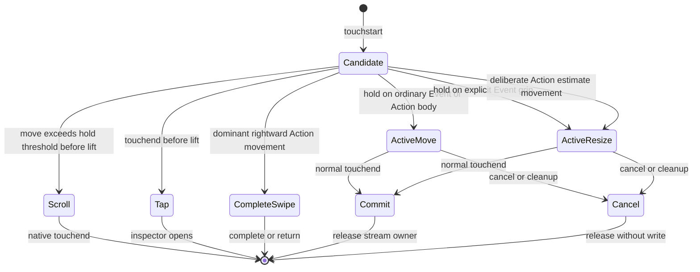
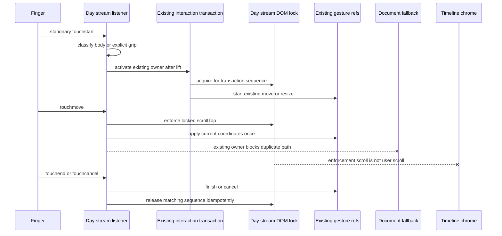

# Mobile Timeline Drag and Scroll Ownership - Plan

## Goal Capsule

- **Objective:** A phone user can reliably move an Event or scheduled Action after a stationary lift without resizing it by accident or moving the Timeline underneath it.
- **Means:** Separate touch resize intent from the desktop edge overlays, reuse the existing interaction transaction as the sole logical owner, lock only the live Day stream while that transaction is active, and prove the behavior with real Chromium touch input (KTD1-KTD4, KTD6).
- **Authority:** `docs/adr/0001-domain-oriented-modular-monolith.md` > `PRODUCT.md` > `docs/spec/structure.md` > `DESIGN.md` > `docs/interaction-contracts/planner-interactions.md` > this plan.
- **Execution profile:** Test-first, surgical interaction correction. Preserve the gesture arithmetic and downstream domain commands.
- **Tail ownership:** The implementing agent owns RED reproductions, production changes, focused and full verification, Windows Chrome visual validation, the QA artifact, commits, and the implementation PR.
- **Stop conditions:** Stop if the fix requires disabling pre-lift Timeline scrolling, weakening Action completion or estimate ownership, changing recurrence/domain arithmetic, rewriting the gesture architecture, changing Week behavior without a new failing Week reproduction, or touching motion, ribbon, navigation, persistence, or Composer code.

---

## Product Contract

### Summary

Correct mobile Day Timeline manipulation at the intent boundary. A normal held grab on an Event body must move the Event. Only an explicit touch resize affordance may resize it. Before lift, vertical movement on an Event or Action body belongs to Timeline scrolling; deliberate vertical movement on the explicit Action estimate control remains direct resize. After lift, the Event or Action owns the gesture and the Day stream remains stationary until end or cancellation.

### Problem Frame

The current Event card draws a 22×2 grip but places it inside invisible full-width resize overlays. The top overlay is 8 px high and the bottom overlay is 12 px high. Touch classification uses the overlay that received `touchstart`, then gives resize precedence when the hold matures.

This consumes about 31% of a normal 60-minute card, about 65% of a 30-minute card, and about 91% of the 22 px minimum card. On short-phone geometry, even a 60-minute Event can be about 41 px high, so almost half of it is edge-owned. Browser reproduction at 390×844 confirmed that a top grab performs `resize-start`, a center grab moves, and a bottom grab performs `resize-end`.

The active Day touch path also lacks exclusive scroll ownership. The local stream handler and a document fallback can both process the same bubbling `touchmove`. The stream's `scroll` handler remains active during manipulation. If the device compositor moves the stream, Event and Action time proposals change because their calculations include the live `scrollTop`, and Timeline chrome can collapse or restore during the same gesture.

### Key Decisions

- **Touch scrolling remains available before lift on card bodies.** A finger that moves on an Event or Action body before the stationary hold matures scrolls the Timeline and never edits a record; the explicit Action estimate control retains direct resize ownership. Governs R5-R6, R14.
- **An Event body is move-first on touch.** Invisible desktop edge overlays do not establish mobile resize intent. Governs R1-R4.
- **Active manipulation freezes only the Day stream.** It does not freeze the page, Week grid, ribbon, or navigation shell. Governs R7-R10.
- **Existing domain behavior remains authoritative.** The correction changes activation and ownership, not time arithmetic, recurrence, persistence, or task semantics. Governs R11-R15.

### Requirements

**Touch target classification**

- R1. A held touch on an ordinary Event body area starts Event move and preserves duration.
- R2. A held touch near an Event's top or bottom, outside the explicit touch grip, starts Event move rather than resize.
- R3. When an Event can expose disjoint 44×44 touch grips without covering its primary content, a held touch on an explicit start or end grip resizes only that edge and preserves the opposite boundary.
- R4. A short or narrow Event that cannot host disjoint coarse-pointer grips is move-first and exposes labeled, keyboard-operable start/end editing through its inspector; overlapping edge hit areas must never turn the whole card into a resize target.

**Pre-lift and active ownership**

- R5. A tap opens the Event or Action inspector, and pre-lift vertical movement from either card body scrolls the Day stream without mutation or a post-scroll inspector open; the explicit Action estimate control is excluded.
- R6. Pre-lift cancellation uses the shared touch hold threshold instead of a larger local literal, so a scroll cannot mature into manipulation afterward.
- R7. When the stationary hold matures, the active Event or Action becomes the sole owner of subsequent touch moves.
- R8. The Day stream's `scrollTop` remains stable from lift through normal end or cancellation.
- R9. A stream-owned touch move is applied once. A document fallback may remain only if a RED characterization proves a supported gesture originates outside the Day stream, and that fallback must ignore the Day-stream transaction.
- R10. The transaction tracks the initiating touch identifier; a second finger, non-owner end, cancel, unmount, node replacement, date change, zoom remount, or Timeline-to-Actions navigation cannot commit, restores the pre-gesture rendered state, and releases ownership exactly once.

**Domain and adjacent interaction safety**

- R11. Event move preserves duration and same-day date while using the existing snapping, recurrence-scope, and commit paths.
- R12. Event start resize preserves the end exactly, and Event end resize preserves the start exactly.
- R13. Scheduled Action move changes `planned.startMinute` without changing `planned.date` or `planned.estimateMinutes`.
- R14. The explicit Action estimate control remains directly resizable and preserves `planned.startMinute`, date, and status.
- R15. Action completion swipe, JOIN, cancellation, next interaction, recurrence, lane packing, Timeline chrome, desktop direct manipulation, and Week manipulation retain their existing contracts.

**Verification and evidence**

- R16. Browser arbitration tests use CDP `Input.dispatchTouchEvent`, not `page.mouse` or synthetic DOM events presented as touch evidence.
- R17. Move and resize tests assert both rendered response and persisted model invariants.
- R18. Scroll-ownership tests assert physical `scrollTop`, product state, and absence of unintended mutation.
- R19. The implementation includes negative controls proving the new regressions fail when touch classification or active scroll ownership is removed.
- R20. Windows Chrome visual QA covers 390×844 and 390×601 mobile viewports plus a 1280×900 desktop regression pass.
- R21. Before public release, representative physical iOS Safari and Android Chrome devices pass Event/Action lift, pre-lift scroll, post-lift ownership, resize, cancellation, and immediate-next-interaction checks. CDP and desktop Chrome emulation are necessary automation evidence, not substitutes for this device gate.

### Key Flows

- F1. **Event move after lift**
  - **Trigger:** One finger starts on an ordinary Event area and remains stationary through the lift threshold.
  - **Steps:** Candidate arms; lift acquires Day-stream ownership; Event move starts; the activating and later coordinates update the preview; release commits through the existing Event finish path.
  - **Outcome:** The Event moves, duration is unchanged, and the Timeline viewport does not move.
  - **Covered by:** R1-R2, R7-R11.
- F2. **Event resize from an explicit grip**
  - **Trigger:** One finger starts on an exposed semantic 44×44 touch grip and remains stationary through the lift threshold.
  - **Steps:** Candidate arms as resize; lift acquires ownership; the chosen edge follows the finger; release commits through the existing resize path.
  - **Outcome:** Only the intended boundary changes and the Timeline viewport does not move.
  - **Covered by:** R3-R4, R7-R8, R12.
- F3. **Scroll before lift**
  - **Trigger:** One finger starts on an Event or Action body and moves vertically before lift.
  - **Steps:** The shared cancellation threshold cancels the candidate; native Day scrolling proceeds; no object owner is acquired.
  - **Outcome:** `scrollTop` changes, the record does not, and release opens no inspector.
  - **Covered by:** R5-R6.
- F4. **Scheduled Action manipulation**
  - **Trigger:** A stationary hold starts on the Action body, or deliberate vertical movement starts on its explicit estimate control.
  - **Steps:** The body path moves after lift; the estimate path resizes directly; both use exclusive stream ownership once active.
  - **Outcome:** The intended Action field changes and completion swipe remains isolated.
  - **Covered by:** R7-R10, R13-R15.
- F5. **Cancellation or remount**
  - **Trigger:** `touchcancel`, component cleanup, stream node replacement, view change, or a superseding interaction occurs.
  - **Steps:** The current owner cancels; scroll state and listeners restore idempotently; no finish command persists data.
  - **Outcome:** The next tap, drag, resize, and scroll operate on the live stream node.
  - **Covered by:** R10, R15.

### Acceptance Examples

- AE1. **Ordinary upper-card grab moves.** Given a 10:00-11:00 Event, when a held touch begins near its title but outside the centered start grip and moves down one hour, then the Event becomes 11:00-12:00 and its duration remains 60 minutes. Covers R1-R2, R11.
- AE2. **Ordinary lower-card grab moves.** Given the same Event, when a held touch begins near the lower edge but outside the centered end grip and moves down, then start changes and duration remains 60 minutes. Covers R2, R11.
- AE3. **Explicit end grip resizes.** Given a tall Event that can host disjoint 44×44 grips, when a held touch begins on the end grip and moves down, then start remains fixed and duration increases. Covers R3, R12.
- AE4. **Short cards stay move-first.** Given 15-, 30-, 60-, and 120-minute Events in normal and narrow lanes, when their geometry cannot host disjoint 44×44 start/end controls, then an ordinary held touch moves the Event and precise start/end editing remains available in the inspector. Covers R1-R4.
- AE5. **Pre-lift scroll wins.** Given a finger starts on an Event or Action, when it moves vertically beyond the hold-cancel threshold before lift, then the Timeline physically scrolls and no model or inspector changes. Covers R5-R6.
- AE6. **Post-lift manipulation wins.** Given an Event or Action has lifted, when several touch moves occur and a forced stream scroll is attempted, then `scrollTop` returns to its locked value and only pointer travel changes the record proposal. Covers R7-R9, R13.
- AE7. **Cancellation cleans the owner.** Given an active held move, when `touchcancel`, a second finger, or a non-owner end occurs, then persistence and rendered geometry return to their pre-gesture state, active styling clears, the stream unlocks, and the next gesture works. Covers R10, R15.

### Scope Boundaries

**In scope**

- Day Timeline touch target classification for Events and scheduled Actions.
- Day Timeline active touch scroll ownership and fallback-listener isolation.
- Pure touch-target and DOM scroll-lock helpers beside the planner feature owner; `timelineInteractionState.js` remains the single logical interaction owner.
- Interaction-contract updates, focused regressions, full validation, and QA evidence.

**Out of scope**

- New gestures, snapping rules, drag visuals, haptics, animation, or persistence behavior.
- Empty-space creation redesign.
- Recurrence, JOIN, Action completion, lane packing, Timeline chrome, or Week behavior changes.
- Motion, Sheet, Composer, navigation, ribbon, themes, notes, provider work, or domain API changes.
- A new drag-and-drop library or a broad `Planner.jsx` gesture rewrite.

### Dependencies and System-Wide Impact

| Dependency | Current coupling | Required protection |
|---|---|---|
| Event geometry | `minutesAt()` includes live Day `scrollTop` | Freeze active stream position so pointer movement is the only time delta. |
| Action geometry | Action move compensates from `originScrollTop` | Preserve start/date/estimate invariants and prevent concurrent viewport travel. |
| Timeline chrome | Every stream `scroll` can call `onTimelineScrollPosition()` | Ignore lock-enforcement scrolls and do not create a user-scroll session during manipulation. |
| Recurrence | `finishGesture()` enters the existing scope flow | Do not bypass or duplicate recurrence commands. |
| Persistence and undo | Normal finish commits once; cancel commits never | Keep existing finish/cancel boundary and prevent duplicate local/document processing. |
| Action completion | Horizontal touch intent owns the completion swipe | Preserve its priority over card move and day navigation. |
| JOIN | Link intent outranks Event manipulation | Retain start-boundary and JSX propagation guards. |
| Interaction lifecycle | `timelineInteractionState.js` already owns phase, owner, sequence, commit, and cancel | Reuse its transaction and sequence token; do not create a parallel logical owner. |
| Remount lifecycle | `attachStream` replaces the native listener node | Release the DOM lock on cleanup and bind only to the live node. |
| Week Timeline | Separate surface with its own touch ownership | Regression-test only unless a new Week RED test proves a shared defect. |
| Desktop input | Full-width edge overlays support direct mouse resize | Preserve `data-resize` and desktop pointer behavior while adding a touch-specific semantic target. |

---

## Planning Contract

### Key Technical Decisions

- KTD1. **Separate desktop resize overlays from touch resize intent.** Keep the current full-width `data-resize` overlays for mouse and pen. An Event exposes centered 44×44 semantic start/end touch controls only when its rendered height is at least 88 px and its rendered lane width is at least 132 px. Place the controls at the top and bottom so they are disjoint and leave at least 44 px of body width on each side. The pointer-only grips remain outside the accessibility tree. Otherwise expose no direct Event touch resize and use the labeled, keyboard-operable inspector as the accessible precise-edit path. The existing explicit 48 px Action estimate control retains touch-resize ownership. The classifier may use semantic attributes, never `data-test`. Governs R1-R4, R14.
- KTD2. **Use the existing touch hold threshold as the ownership boundary.** Before lift, `touch-action: pan-y` remains and `movedEnoughToCancelHold()` owns cancellation. After lift, the object owner prevents default handling and stops local movement from reaching the document fallback. Do not change `touch-action` during an active sequence because the user agent determines permitted pan behavior at gesture start. Governs R5-R9.
- KTD3. **Keep `timelineInteractionState.js` as the only logical owner.** Arm and activate the existing Day-stream transaction with its owner, origin, touch input, and sequence. A separate bounded DOM lock may snapshot the initiating touch identifier, live stream node, `scrollTop`, and inline state, but it is keyed to that existing sequence and cannot commit, cancel, or invent another interaction phase. While active, resolve only the initiating touch, reject multi-touch, enforce the snapshot, and suppress Timeline chrome notification for enforcement scrolls. Release idempotently on all terminal and cleanup paths. Governs R7-R10.
- KTD4. **Keep one application of each touch move.** First add a RED characterization for any gesture that genuinely starts outside the Day stream and requires the document fallback. A stream-originated active move is handled by the stream listener, gates on the existing `INTERACTION_OWNERS.dayStream` transaction, and does not reach the document path. Preserve the document path only for the externally-originated case proven by that characterization; otherwise remove the unsupported touch fallback rather than coordinating two speculative owners. Governs R7, R9-R10.
- KTD5. **Extract pure DOM mechanics, not a second state machine.** Put semantic target classification in `src/features/planner/timelineTouchTarget.js` and the sequence-keyed bounded DOM lock in `src/features/planner/timelineTouchScrollLock.js`, each with colocated unit tests. They may classify targets and snapshot/enforce/release DOM state only. Keep interaction phase, logical owner, commit, and cancel in `timelineInteractionState.js`, and keep `Planner.jsx` changes to semantic markup and lifecycle wiring. Governs R1-R10.
- KTD6. **Treat browser, model, and device evidence as a joint release gate.** CDP tests must observe touch arbitration, physical `scrollTop`, UI state, and persisted records; representative physical devices must close the platform-specific release risk. A screenshot or a storage assertion alone cannot close the defect. Governs R16-R21.

### High-Level Technical Design

The diagram is directional, not a required function or class layout.

### Implementation Constraints

- Keep `touch-action: pan-y` before lift. Do not apply `touch-action: none` to whole cards or the Day stream.
- Do not change `LIFT_MS`, snapping, minimum duration, or direct desktop activation thresholds without a new failing characterization.
- Do not put new standalone helper definitions at the bottom of `Planner.jsx`.
- Do not add per-touch-move React state or persist during movement.
- Do not use global body scroll locking, polling, or arbitrary sleeps as correctness mechanisms.
- Do not add edge auto-scroll during an active drag; this remediation deliberately keeps the Day viewport fixed.
- Do not weaken existing grip-scroll, Action swipe, JOIN, recurrence, cancellation, or remount tests.
- The lock must tolerate a detached stream node and repeated or stale release calls, and it must never become an interaction authority of its own.

### Research Sources

- `src/Planner.jsx:3139-3328` — delegated Day touch candidate, lift, move, scroll, end, and cancel lifecycle.
- `src/Planner.jsx:3330-3366` — document fallback that can receive the same bubbling touch move.
- `src/Planner.jsx:4286-4368` — Event card and full-width desktop resize overlays.
- `src/features/planner/TimelineActionCard.jsx:100-152` — explicit scheduled Action estimate region.
- `src/features/planner/timelineGesture.js` — shared touch thresholds, intent, snapping, and proposal arithmetic.
- `tests/e2e/timeline-touch.spec.js` — current CDP touch harness and explicit grip coverage.
- `tests/e2e/timeline-gestures.spec.js` and `tests/e2e/actions.spec.js` — persisted Event/Action move and pre-lift scroll contracts.
- [W3C Pointer Events: `touch-action` behavior](https://www.w3.org/TR/pointerevents/#the-touch-action-css-property) — the user agent determines permitted direct-manipulation behavior at gesture start; later changes do not alter the current gesture.
- [Chrome scrolling intervention guidance](https://developer.chrome.com/blog/scrolling-intervention/) — touch cancellation behavior must not depend on an implicit passive-listener assumption.

### Sequencing

1. Add the RED browser and unit contracts without changing production behavior.
2. Add the touch target classifier and explicit semantic grips.
3. Reuse the existing interaction owner, add the bounded Day-stream DOM lock, and isolate or remove the duplicate listener path based on the RED characterization.
4. Harden cancellation, remount, Action, and adjacent interaction regressions.
5. Run focused, repeated, full, and visual verification before documentation and PR handoff.

---

## Implementation Units

### U1. Reproduce target and ownership failures

- **Goal:** Turn the observed device behavior into deterministic failing regressions before production changes.
- **Requirements:** R1-R9, R16-R19.
- **Files:** `tests/e2e/timeline-touch.spec.js`, `tests/e2e/timeline-gestures.spec.js`, `tests/e2e/actions.spec.js`, and `tests/e2e/helpers.js` only if a shared CDP helper removes duplication.
- **Approach:** Add CDP touch cases for ordinary upper and lower Event grabs outside the visible grip, explicit grip resize, short-card move space, multi-step Event/Action move with stable `scrollTop`, and a forced post-lift stream-scroll attempt. Capture start, duration, date, estimate, scroll metrics, and inspector state. Keep current production untouched until each targeted contract is observed RED for the expected reason.
- **Execution note:** Test-first proof is mandatory. Do not infer RED from code inspection.
- **Test scenarios:**
  - A 60-minute Event upper grab outside the grip currently changes start/duration; expected move preserves duration.
  - A 60-minute Event lower grab outside the grip currently extends the Event; expected move preserves duration.
  - 15-, 30-, 60-, and 120-minute Events in wide and narrow lanes remain move-first when two disjoint 44×44 touch grips cannot fit.
  - A tall Event with eligible geometry exposes disjoint start/end touch grips and preserves the opposite boundary during resize.
  - A held Event and held Action reject a forced `scrollTop` change after lift.
  - Characterize a real touch gesture that starts outside the Day stream and still needs the document fallback. If no such supported flow is reproducible, the implementation must not retain the fallback merely as a hypothetical compatibility path.
  - Removing the real touch movement or grip classification causes the new tests to fail.
- **Verification:** Run targeted `--grep` cases with `--workers=1` and record the exact RED assertions.

### U2. Add touch target and DOM scroll-lock helpers

- **Goal:** Give touch role classification and Day-stream DOM lock mechanics feature-owned implementations without duplicating logical ownership.
- **Requirements:** R1-R10.
- **Files:** `src/features/planner/timelineTouchTarget.js`, `src/features/planner/timelineTouchTarget.test.js`, `src/features/planner/timelineTouchScrollLock.js`, `src/features/planner/timelineTouchScrollLock.test.js`, plus `src/features/planner/timelineInteractionState.js` and its test only if the RED contract proves an existing transaction field/helper is missing.
- **Approach:** Implement semantic target classification per KTD1 and an idempotent sequence-keyed DOM stream lock per KTD3-KTD4. The classifier distinguishes Event body, Event touch grip, Action body, explicit Action estimate, complete control, link, and empty space. The lock only records and restores node state; it receives the existing interaction sequence and must reject stale sequence operations. It cannot own persistence or phase changes.
- **Test scenarios:**
  - `data-resize` without an eligible `data-touch-resize` is a touch move candidate.
  - Explicit Event start/end grips and the Action estimate region classify as resize.
  - JOIN and completion controls classify as excluded owners.
  - Acquire, enforce, release, repeated release, node replacement, second-finger cancellation, and non-owner end restore the original node state without commit.
  - A stale sequence cannot unlock or apply a newer transaction.
  - Existing `timelineInteractionState.js` remains the only module deciding arm, activate, cancel, and commit.
- **Verification:** `node --test src/features/planner/timelineTouchTarget.test.js src/features/planner/timelineTouchScrollLock.test.js src/features/planner/timelineInteractionState.test.js`.

### U3. Correct Event touch classification without changing desktop resize

- **Goal:** Make ordinary phone grabs move Events while retaining explicit start/end resize and desktop edge behavior.
- **Requirements:** R1-R4, R11-R12.
- **Files:** `src/Planner.jsx`, `tests/e2e/timeline-touch.spec.js`, `tests/e2e/timeline-gestures.spec.js`.
- **Approach:** At `touchstart`, read the live Event lane rectangle and apply KTD1's 88×132 eligibility threshold in the pure classifier. Add centered 44×44 semantic touch-grip regions around the existing drawn lines; an ineligible marker resolves to Event body rather than resize. Retain full-width `data-resize` overlays and `onPointerDown` for mouse/pen. Use `movedEnoughToCancelHold()` for touch candidate cancellation instead of the local 12 px test. Keep top/end proposal arithmetic unchanged.
- **Test scenarios:**
  - Ordinary top/title, center, and lower-edge grabs move and preserve duration.
  - Eligible explicit top grip preserves end; eligible explicit bottom grip preserves start.
  - Ineligible short/narrow cards expose no overlapping touch resize target and remain editable through the inspector.
  - Pure boundary tests cover just below, exactly at, and just above 88 px height and 132 px width; browser cases cover lane packing, narrow phone geometry, and altered text/viewport scale so eligibility follows live geometry rather than an assumed duration.
  - Pointer-only touch grips remain hidden from assistive technology, while keyboard and screen-reader users can open the Event inspector and precisely edit start and end.
  - Tap and pre-lift scroll from the body and non-grip edge retain current behavior.
  - Desktop immediate move and both desktop edge resizes remain green.
- **Verification:** Run `timeline-touch.spec.js` and the Event drag/resize subset of `timeline-gestures.spec.js` three consecutive times.

### U4. Enforce one active owner and stable Day scroll

- **Goal:** Stop the Timeline from moving underneath active Event and Action manipulations.
- **Requirements:** R7-R10, R13-R15.
- **Files:** `src/Planner.jsx`, `src/features/planner/TimelineActionCard.jsx` only for semantic Action marker wiring, `tests/e2e/timeline-touch.spec.js`, `tests/e2e/actions.spec.js`.
- **Approach:** Activate the existing Day-stream interaction owner immediately before an active touch move/resize starts, then acquire the sequence-keyed DOM lock. In the local active path, prevent default, stop propagation, enforce the locked position, and apply current coordinates once. In `onScroll`, restore active-lock drift and skip Timeline chrome notification. Gate or remove the document fallback according to U1's characterization. Release the lock on normal end, cancel, effect cleanup, node replacement, and supersession; only the existing interaction lifecycle may commit or cancel.
- **Test scenarios:**
  - Multi-step Event and Action drags leave `scrollTop` unchanged while model proposals follow the finger.
  - A forced post-lift scroll is restored and does not collapse Timeline chrome.
  - Action estimate resize remains direct and keeps start/date/status.
  - `touchcancel`, a second finger, and a non-owner `touchend` write nothing, restore card position/duration or estimate and active styling, unlock the stream, and leave the next scroll and drag usable.
  - Day/date/zoom and Actions-to-Timeline remounts cannot leave a detached node locked.
- **Verification:** Run the touch ownership unit, Timeline touch, Action touch, cancellation, and interaction-contract suites.

### U5. Protect upstream and downstream integrations

- **Goal:** Prove the surgical ownership correction does not change adjacent gesture or domain behavior.
- **Requirements:** R11-R18.
- **Files:** `tests/e2e/gesture-isolation.spec.js`, `tests/e2e/interaction-contracts.spec.js`, and existing adjacent specs only when an assertion gap is proven; `docs/interaction-contracts/planner-interactions.md`.
- **Approach:** Update the interaction contract with the pre-lift/post-lift ownership split, explicit Event grip semantics, and document-fallback rule. Add only missing behavioral assertions. Do not modify unrelated production modules to satisfy this unit.
- **Test scenarios:**
  - Action completion swipe completes without move, navigation, inspector, or resize.
  - JOIN follows the meeting without Event manipulation.
  - Recurring Event move/resize still reaches the existing scope flow.
  - Timeline chrome responds to real scrolling before lift but not lock enforcement after lift.
  - Week same-day and cross-day move, desktop direct manipulation, navigation, and ribbon behavior remain green.
- **Verification:** Run `gesture-isolation.spec.js`, `interaction-contracts.spec.js`, `recurring.spec.js`, `join.spec.js`, `week-drag.spec.js`, `timeline-chrome-scroll.spec.js`, and `navigation-shell.spec.js` with one worker.

### U6. Validate visually and publish QA evidence

- **Goal:** Close the defect with reproducible behavioral, visual, and dependency evidence.
- **Requirements:** R16-R21.
- **Files:** `docs/qa/2026-08-22-mobile-timeline-drag-scroll-ownership.md`.
- **Approach:** Use the production build on an isolated port. In Windows Chrome at 100% zoom, exercise human-speed tap, pre-lift scroll, hold+move, explicit resize, Action swipe, cancellation, and immediate next interaction. Document exact viewport and model/scroll results. Before public release, repeat the core ownership matrix on one representative physical iOS Safari device and one representative physical Android Chrome device. If those devices are unavailable during implementation, the PR must say `implementation verified; physical-device release gate pending` and must not claim production mobile certification.
- **Test scenarios:**
  - 390×844 and 390×601: Event tap, ordinary upper/center/lower held move, short/narrow-card move eligibility, tall-card explicit start/end resize, scroll-from-card, multi-touch cancellation, Action tap/move/estimate resize/completion.
  - 1280×900: Event and Action click, immediate direct drag, Event start/end resize, Action estimate resize, Timeline scroll.
  - Fresh load and Actions-to-Timeline return show no stale lock, blank state, chrome jump, or gesture dead zone.
- **Verification:** Complete the command matrix below, `git diff --check`, explicit-path diff review, Windows Chrome visual pass, and QA report review.

---

## Verification Contract

Use an isolated Playwright preview port so another worktree cannot satisfy the tests.

| Gate | Command | Required result |
|---|---|---|
| Gesture and ownership units | `node --test src/features/planner/timelineGesture.test.js src/features/planner/timelineInteractionState.test.js src/features/planner/timelineTouchTarget.test.js src/features/planner/timelineTouchScrollLock.test.js` | All pass. |
| Event touch | `npx playwright test tests/e2e/timeline-touch.spec.js tests/e2e/timeline-gestures.spec.js --workers=1` | All pass. |
| Action touch | `npx playwright test tests/e2e/actions.spec.js --workers=1 --grep "touch|swipe|drag|resize|timeline"` | All selected cases pass. |
| Immediate repeat gate | Repeat the new Event/Action move, resize, scroll-lock, and cancellation cases three times. | No intermittent ownership or scroll failure. |
| Gesture isolation | `npx playwright test tests/e2e/gesture-isolation.spec.js tests/e2e/interaction-contracts.spec.js --workers=1` | All pass. |
| Domain adjacency | `npx playwright test tests/e2e/recurring.spec.js tests/e2e/join.spec.js --workers=1` | Existing recurrence and JOIN flows pass. |
| Surface adjacency | `npx playwright test tests/e2e/week-drag.spec.js tests/e2e/timeline-chrome-scroll.spec.js tests/e2e/navigation-shell.spec.js --workers=1` | No Week, chrome, or navigation regression. |
| Unit suite | `npm test` | All unit tests pass. |
| Production build | `npm run build` | Build succeeds. |
| Full browser suite | `npx playwright test --workers=1` | Green, or any remaining failure is reproduced against the exact base in the same environment before classification. |
| Visual QA | Production build in Windows Chrome at 390×844, 390×601, and 1280×900 | Interaction and layout checklist in U6 passes. |
| Physical-device release gate | Representative iOS Safari and Android Chrome devices | Core pre-lift scroll, lift/move, resize, cancellation, and next-interaction flows pass before public release; otherwise explicitly remain pending. |
| Diff integrity | `git diff --check`, `git status --short`, and explicit-path `git diff` | Only planned files change; no abandoned probes or user files remain. |

Negative controls are local evidence and must not be committed:

1. Restore full-width Event touch resize classification; AE1 or AE2 must fail.
2. Disable active stream enforcement; AE6 must fail because `scrollTop` drifts or Timeline chrome receives the forced scroll.
3. Allow the local active move to reach the document fallback; the one-owner assertion must fail.
4. Skip release on cancellation; the cancellation-and-next-interaction regression must fail.

---

## Definition of Done

- [ ] Each U1 RED reproduction was observed against the implementation base before production changes.
- [ ] Ordinary upper, center, and lower Event grabs move the Event and preserve duration.
- [ ] Only eligible, disjoint 44×44 semantic Event touch grips perform direct start/end resize.
- [ ] Short and narrow Events remain move-first and retain inspector-based precise editing.
- [ ] Pre-lift Event and Action vertical movement physically scrolls without mutation or inspector open.
- [ ] Post-lift Event and Action manipulation keeps the Day stream stationary.
- [ ] Each stream-owned touch move is applied once; any retained document fallback has a demonstrated external-origin use case and ignores the Day-stream owner.
- [ ] Cancellation, a second finger, a non-owner end, and every remount terminal restore rendered state, release the lock, and allow the next interaction.
- [ ] Event/Action stored model invariants pass for move and resize.
- [ ] Action estimate resize, completion swipe, JOIN, recurrence, Timeline chrome, Week, desktop direct manipulation, navigation, and ribbon regressions pass.
- [ ] No motion, Sheet, Composer, domain API, persistence, ribbon, navigation, or Week production file changed without a new failing reproduction and explicit scope review.
- [ ] Unit tests pass.
- [ ] Production build passes.
- [ ] Full Playwright passes, or remaining failures have exact-base same-environment evidence.
- [ ] Windows Chrome visual QA passes at 390×844, 390×601, and 1280×900.
- [ ] Physical iOS Safari and Android Chrome release evidence is recorded, or the implementation PR is explicitly marked as pending that external release gate and does not claim production mobile certification.
- [ ] `docs/interaction-contracts/planner-interactions.md` and `docs/qa/2026-08-22-mobile-timeline-drag-scroll-ownership.md` match the shipped behavior and evidence.
- [ ] All temporary probes, sabotage, logs, screenshots outside the QA artifact, and abandoned code are removed.
- [ ] Changes are committed in coherent slices, pushed to a corrective branch, and opened as a PR against the plan-bearing `main`.
