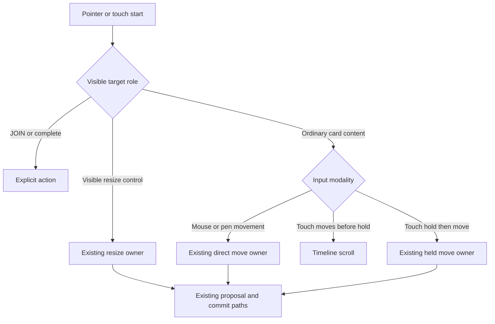

# Timeline Interaction Intent Integrity - Plan

## Goal Capsule

- **Objective:** Make Day Event and scheduled Action move/resize intent predictable at human touch and pointer speeds, and keep the Day `ANY TIME` landmark present when it has no Actions.
- **Authority:** `DESIGN.md` and `docs/interaction-contracts/planner-interactions.md` govern interaction quality and ownership. This plan corrects the current contract where its hidden hit areas contradict direct manipulation.
- **Execution profile:** Use test-driven changes on `fix/timeline-interaction-intent-integrity`. Preserve the existing gesture owner, persistence, snapping, recurrence, lane packing, and touch scroll lock.
- **Stop conditions:** Stop if the fix needs a second gesture state machine, domain changes, motion/navigation changes, immediate touch-body dragging, overlapping invisible hit slop, or broader `Planner.jsx` growth.
- **Tail ownership:** Commit the plan first, implement in isolated commits, run automated and Windows Chrome validation, request code review, push, and open a PR. Do not merge.

---

## Product Contract

### Summary

This plan makes the visible control under the pointer or finger match the operation that will occur. Event and Action card content remains the move surface, resize uses a visible dedicated control, and Day keeps a stable `ANY TIME` location even when there are no flexible Actions.

### Problem Frame

The reported inconsistency is reproducible and spatial, not random. A 141×99px eligible Event currently places two transparent 44×44 resize targets over its horizontal center. A held touch at the side moves the Event, while the same touch at the center-top changes the start and a center-bottom touch changes the end. The two hidden targets occupy 88 of the card's 99 vertical pixels in the center column. The visible 22×2 edge marks do not communicate this ownership area.

Scheduled Actions use a different hidden grammar. Their body moves after a stationary touch hold, the left 32px control completes, and a right 48px estimate control resizes only when an estimate exists. In narrow collision lanes the completion and estimate regions can consume nearly all usable width. The implementation works when the exact target is known, but the visible card does not make the three ownership zones clear.

`ANY TIME` is not intermittently failing to load. Day removes the entire section when there is no all-day Event and no unscheduled or carried Action. Windows Chrome reproduced this on 2026-08-26 while the sample day 2026-08-23 rendered the section. This is a product information-architecture gap, not a stale-bundle defect. Week intentionally has no `ANY TIME` section.

The existing scroll-lock and interaction-state logic behaved correctly in the same controlled build. Before lift, real touch movement scrolls the Timeline and leaves records unchanged. After lift, an Action followed the finger while the Day stream retained the same `scrollTop`. The plan therefore changes target presentation and classification, not gesture arithmetic or ownership architecture.

### Requirements

#### Event intent

- R1. Ordinary visible Event content must always represent move intent for mouse, pen, and touch.
- R2. Direct Event resize must start only from a visible, dedicated start or end control whose semantic hit area matches its rendered affordance.
- R3. An eligible Event must retain a usable move region after resize controls and JOIN are reserved.
- R4. Compact, narrow, or control-congested Events must remain move-first and use the inspector for precise duration edits instead of overlapping invisible hit targets.
- R5. Desktop mouse and pen must retain movement-driven activation at the existing 3px threshold, including same-movement visual catch-up.
- R6. Touch Event body movement before lift must scroll without mutation, while a stationary hold followed by movement must move the Event with Timeline scroll locked.
- R7. Event start resize must preserve the end, and Event end resize must preserve the start.

#### Action intent

- R8. Scheduled Action body content must remain the move surface, the completion control must remain distinct, and the estimate control must visibly communicate resize intent.
- R9. A directly resizable Action must retain a measurable body move target beside completion and estimate controls; a lane too narrow to satisfy that contract must remain move-first and use the inspector for estimate editing.
- R10. Unestimated Actions must expose no resize owner.
- R11. Action move must preserve date and estimate; Action resize must preserve date, start minute, and status.
- R12. Touch Action body movement before lift must scroll without mutation, while a stationary hold followed by movement must move the Action with Timeline scroll locked.

#### Stable Timeline information architecture

- R13. Day must always render the `ANY TIME` landmark above the Timeline, including a compact empty state when no flexible Action is available.
- R14. The empty state must not claim that completed, cancelled, deadline-owned, recurring, or scheduled work belongs in `ANY TIME`.
- R15. `ANY TIME` must retain horizontal swipe ownership and edge fades only when chips are present.
- R16. Week must remain free of the Day-only `ANY TIME` shelf.
- R17. The persistent shelf must preserve usable Timeline height at 390×601 and must not alter all-day Event behavior.

#### Ownership and safety

- R18. One sequence must retain one owner from armed through active to committed or cancelled.
- R19. Pointer or touch cancellation, a second finger, remount, date change, or navigation must restore the model snapshot and allow the next interaction to work.
- R20. JOIN must open the meeting and must never arm move or resize.
- R21. Recurrence scope, persistence APIs, snapping, minimum durations, lane freeze, Timeline chrome, navigation, ribbon, Composer, and motion behavior must remain unchanged.

### Key Flows

- F1. Event body move
  - **Trigger:** A pointer moves at least 3px, or a stationary touch hold matures, on ordinary Event content.
  - **Steps:** The existing Event move owner activates, applies the current coordinates, freezes the live lane arrangement, and commits through the current Event path.
  - **Outcome:** Start changes, duration is preserved, and no inspector opens after drop.
  - **Covers:** R1, R3, R5, R6, R18, R21
- F2. Event explicit resize
  - **Trigger:** The user starts from a visible start or end resize control on an eligible Event.
  - **Steps:** The current Event resize mode activates after the modality-specific intent threshold and commits through the current resize path.
  - **Outcome:** Exactly one boundary changes and ordinary body content never becomes resize by proximity alone.
  - **Covers:** R2, R4, R7, R18, R20
- F3. Action intent arbitration
  - **Trigger:** The user starts on Action completion, ordinary body content, or an eligible estimate control.
  - **Steps:** Existing target priority selects one owner and the existing Action paths handle completion, move, or estimate resize.
  - **Outcome:** Each visible zone causes one predictable model outcome.
  - **Covers:** R8, R9, R10, R11, R12, R18
- F4. Empty Day shelf
  - **Trigger:** Day renders with no flexible Action.
  - **Steps:** The stable shelf renders its label and compact empty state without a horizontal scroller.
  - **Outcome:** `ANY TIME` remains findable, the Timeline stays usable, and Week remains unchanged.
  - **Covers:** R13, R14, R15, R16, R17

### Acceptance Examples

- AE1. **Covers R1, R2, R3:** Given a 141×99px Event, when a real touch starts on the visible title or center body and holds before moving, then the Event moves and its duration stays fixed.
- AE2. **Covers R2, R7:** Given the same Event, when a real touch starts on the visible start control and moves down, then the start changes and the end remains exact; the end control produces the inverse invariant.
- AE3. **Covers R4:** Given a compact or narrow Event, when a touch holds anywhere on card content, then it moves; no hidden resize region exists.
- AE4. **Covers R8-R11:** Given an estimated Action with sufficient width, body, completion, and estimate regions produce move, complete, and resize respectively; given an unestimated or too-narrow Action, body remains usable and no direct resize owner exists.
- AE5. **Covers R6, R12, R18:** Given a touch begins on Event or Action body, movement before lift physically changes `scrollTop` and writes nothing; movement after lift changes the model while `scrollTop` remains fixed.
- AE6. **Covers R13-R17:** Given a Day with every Action scheduled, when the surface renders at 390×601, then `ANY TIME` and its empty state are visible and the Timeline retains usable height; Week still has no shelf.
- AE7. **Covers R19:** Given an active Event or Action interaction is cancelled, then persistence remains unchanged and the next tap, drag, and scroll work.

### Scope Boundaries

- Do not change the 3px direct-pointer threshold, 300ms touch lift, 8px hold-cancel threshold, snapping, minimum durations, recurrence, or persistence APIs.
- Do not change Week Event gesture code or add Week Actions.
- Do not change Timeline chrome, ribbon, navigation, Composer, Sheet, or motion code.
- Do not make Event or Action body touch movement immediate; pre-lift vertical movement must remain available to scroll.
- Do not add another gesture owner, document fallback, drag library, per-frame React state path, or invisible overlapping hit slop.
- Do not turn the empty `ANY TIME` state into a task query that changes carry, deadline, recurrence, completion, or cancellation semantics.

---

## Planning Contract

### Key Technical Decisions

- KTD1. Replace the transparent centered Event targets with an extracted, visible edge-control component. The control reserves a declared lane and leaves ordinary content as the move surface. Eligibility accounts for card width, height, and JOIN occupancy. This implements R1-R4 and avoids adding more markup to `Planner.jsx`.
- KTD2. Keep touch target classification declarative. `classifyTimelineTouchTarget()` continues to prioritize explicit controls, but only visibly rendered resize controls carry `data-touch-resize`. The interaction state machine remains unchanged. This implements R2, R18, and R20.
- KTD3. Require a minimum Action body lane after completion and estimate reservations. Below that width, direct estimate resize is not rendered and the inspector remains the precise-edit path. This implements R8-R10 without duplicating Action gesture arithmetic.
- KTD4. Extract the Day shelf into a planner feature component so the stable empty state does not grow `Planner.jsx`. The component receives the already-filtered flexible Actions and existing callbacks; it does not own data selection. This implements R13-R17.
- KTD5. Use actual browser input and model assertions as the release evidence. A mobile viewport with mouse input, class-name checks, or eventual visual position alone does not prove touch ownership.

### High-Level Technical Design

The target layer decides only which existing gesture mode starts. The proposal, lane-freeze, cancellation, recurrence, and persistence layers remain downstream and unchanged.

### System-Wide Impact

| Dependency | Direction | Risk | Protection |
|---|---|---|---|
| Timeline target classification | Upstream | Hidden control can route the wrong gesture | Point-grid and real-input tests assert the actual owner |
| Day stream scroll lock | Parallel | A lifted card and Timeline could move together | Preserve sequence-keyed lock; assert physical `scrollTop` before and after lift |
| Event recurrence and persistence | Downstream | Target changes could bypass scope or alter both boundaries | Keep existing finish paths; assert stored invariants and recurrence flow |
| Action completion | Adjacent | A resize or move target could steal horizontal completion | Preserve explicit priority and real-touch completion coverage |
| JOIN | Adjacent | A new Event control could overlap the trailing link | Include linked-card geometry and activation tests |
| Lane packing | Upstream geometry | Narrow cards may lose their move target | Enforce minimum body lane and compact fallback |
| Day height fitting | Downstream layout | Persistent shelf could starve short viewports | Validate 390×601 and dynamic height |
| Week | Adjacent surface | Day-only shelf or gesture changes could leak | Assert Week absence and run Week drag suites |
| Timeline chrome | Downstream | Lock enforcement could look like user scroll | Keep suppression path unchanged and run chrome tests |

### Assumptions

- The inspector remains an acceptable precise-edit fallback when a card cannot expose separate coarse-pointer move and resize targets without overlap.
- A compact text empty state under a persistent `ANY TIME` label is preferable to deleting the landmark.
- Windows Chrome CDP validates Chromium arbitration but does not close Android Chrome or iOS Safari physical-device gates.

### Sequencing

1. Add RED geometry, human-point, and empty-shelf tests before production changes.
2. Implement visible Event controls and Action minimum-body geometry without changing gesture ownership code.
3. Extract and render the stable Day shelf.
4. Run negative controls, focused suites, full verification, Windows Chrome review, and code review.

---

## Implementation Units

### U1. Pin visible target ownership with RED tests

- **Goal:** Make the current hidden target ambiguity and conditional shelf fail deterministically before production edits.
- **Requirements:** R1-R4, R8-R10, R13-R17
- **Files:** `src/features/planner/timelineTouchTarget.test.js`, `tests/e2e/timeline-touch.spec.js`, `tests/e2e/timeline-gestures.spec.js`, `tests/e2e/actions.spec.js`, `tests/e2e/timeline-polish.spec.js`
- **Approach:** Add a point-grid helper that records `elementFromPoint()` role and a human-speed real-input helper that also checks the stored record. Cover Event title/center/edge, estimated Action body/complete/estimate, unestimated Actions, narrow lanes, and a Day with no flexible Action. Assert physical controls and computed geometry rather than class names alone.
- **Test scenarios:** AE1-AE6, including 10-, 15-, 30-, 60-, and 120-minute Events where feasible; overlapping lanes; 390×844; 390×601; 1280×900.
- **Verification:** Run each new test alone on exact base and record the intended RED reason. The Event-body test must fail because the hidden center grip owns resize. The empty-shelf test must fail because `ANY TIME` is absent.

### U2. Replace hidden Event resize ownership

- **Goal:** Make Event body and resize intent visually and spatially congruent.
- **Requirements:** R1-R7, R18-R21
- **Files:** `src/Planner.jsx`, `src/features/planner/TimelineEventResizeControls.jsx`, `src/features/planner/timelineTouchTarget.js`, `src/features/planner/timelineTouchTarget.test.js`, `docs/interaction-contracts/planner-interactions.md`
- **Dependencies:** U1
- **Approach:** Extract the resize-control markup. Remove the transparent centered overlays. Render visible start/end controls only when the card can reserve their lane and still satisfy the move and JOIN geometry contracts. Route mouse and pen through the existing `resizeDown()` path and touch through the delegated classifier. Preserve the existing full-width thin desktop edge affordances only where they do not override explicit semantic controls. Keep `Planner.jsx` at or below its architecture ceiling.
- **Test scenarios:** Event body move, start resize, end resize, 1-2px pointer jitter, stationary mouse hold, touch pre-lift scroll, touch post-lift move, cancellation, linked Event JOIN, recurring Event scope, and compact-card fallback.
- **Verification:** `node --test src/features/planner/timelineTouchTarget.test.js`; focused Playwright Event tests; `node --test src/architecture.test.js`.

### U3. Make Action ownership legible and preserve a move lane

- **Goal:** Prevent Action completion and estimate controls from consuming the entire movable card.
- **Requirements:** R8-R12, R18-R21
- **Files:** `src/features/planner/TimelineActionCard.jsx`, `tests/e2e/actions.spec.js`, `tests/e2e/timeline-touch.spec.js`, `tests/e2e/gesture-isolation.spec.js`
- **Dependencies:** U1
- **Approach:** Add a visible resize cue to eligible estimate controls and gate direct resize on sufficient card width for the existing completion, body, and estimate zones. Preserve the existing callbacks and gesture payloads. Keep unestimated and narrow Actions move-first.
- **Test scenarios:** Body move, explicit estimate resize, completion swipe, vertical pre-lift scroll, post-lift scroll lock, narrow collision lane, unestimated Action, cancellation, and next interaction.
- **Verification:** Focused Action and gesture-isolation Playwright suites with real CDP input for touch-sensitive cases.

### U4. Keep Day `ANY TIME` stable when empty

- **Goal:** Preserve a predictable Day landmark without changing which Actions qualify.
- **Requirements:** R13-R17, R21
- **Files:** `src/Planner.jsx`, `src/features/planner/TimelineAnyTimeShelf.jsx`, `tests/e2e/timeline-polish.spec.js`, `tests/e2e/interaction-contracts.spec.js`
- **Dependencies:** U1
- **Approach:** Extract the Day shelf and render it for every Day state. When no flexible Action exists, render a compact neutral empty message and no horizontal scroller. When chips exist, reuse the current drag, click, edge-fade, and `data-owns-swipe` behavior. Keep all-day Events in the same upper surface and preserve stream corner geometry.
- **Test scenarios:** Empty current day, all work scheduled, one carried flexible Action, past day, all-day-only day, 390×601 capacity, Day/Week round trip, and Week absence.
- **Verification:** Focused Timeline polish and interaction-contract suites, plus short-viewport screenshots and DOM geometry checks.

### U5. Regression, visual validation, and QA record

- **Goal:** Prove the corrected intent model does not regress adjacent systems.
- **Requirements:** R1-R21
- **Files:** `docs/qa/2026-08-23-timeline-interaction-intent-integrity.md`
- **Dependencies:** U2, U3, U4
- **Approach:** Run negative controls by locally restoring the hidden Event overlays and conditional shelf, then restore production. Validate real Windows Chrome at three viewports and document before/after evidence. Request a code review before recommending merge.
- **Test scenarios:** Repeated move/resize, pre/post-lift scroll, completion, JOIN, recurrence, remount/cancellation, Week, Timeline chrome, navigation, ribbon, Composer, and motion smoke.
- **Verification:** Complete the Verification Contract and record exact environment, commands, counts, residual physical-device gates, commits, and PR URL.

---

## Verification Contract

| Gate | Command or method | Applies to | Done signal |
|---|---|---|---|
| Target helpers | `node --test src/features/planner/timelineTouchTarget.test.js src/features/planner/timelineGesture.test.js src/features/planner/timelineInteractionState.test.js` | U1-U3 | All pass with no threshold changes |
| Architecture | `node --test src/architecture.test.js` | U2, U4 | `Planner.jsx` remains at or below its ceiling |
| Event gestures | `npx playwright test tests/e2e/timeline-gestures.spec.js tests/e2e/timeline-touch.spec.js --project=chromium --workers=1` | U1, U2 | All pass; new direct and touch cases pass three consecutive runs |
| Action gestures | `npx playwright test tests/e2e/actions.spec.js tests/e2e/gesture-isolation.spec.js --project=chromium --workers=1` | U1, U3 | All pass; completion, move, resize, and scroll ownership stay distinct |
| Day shelf | `npx playwright test tests/e2e/timeline-polish.spec.js tests/e2e/interaction-contracts.spec.js --project=chromium --workers=1` | U1, U4 | Empty and populated Day cases pass; Week remains absent |
| Adjacent calendar | `npx playwright test tests/e2e/week-drag.spec.js tests/e2e/timeline-chrome-scroll.spec.js tests/e2e/recurring.spec.js tests/e2e/join.spec.js --project=chromium --workers=1` | U5 | All pass or any failure is compared on exact base in the same environment |
| Unit suite | `npm test` | U5 | Green |
| Production build | `npm run build` | U5 | Green |
| Full browser suite | `npx playwright test --project=chromium --workers=1` | U5 | Green or every residual failure is reproduced on exact base with the same browser, port strategy, and worker count |
| Windows Chrome | Visible production preview at 1280×900, 390×844, and 390×601 using real pointer and CDP touch input | U5 | No hidden operation zones, post-lift Timeline drift, dead move lanes, missing Day landmark, or visual overlap |
| Code review | Compound Engineering code review on the final diff | U5 | No unresolved blocking or high-severity finding |

Negative controls must remain uncommitted:

- Restore the transparent centered 44×44 Event targets. The body point-grid and real-touch move test must turn RED.
- Remove the Action minimum body-lane gate. The narrow-lane geometry test must turn RED.
- Restore conditional `ANY TIME` mounting. The empty-Day landmark test must turn RED.
- Disable post-lift scroll lock only in a local sabotage. The forced-scroll restoration test must turn RED.

---

## Definition of Done

- All requirements R1-R21 have at least one passing acceptance or regression test.
- New tests were observed RED against the exact base for the intended reasons before production corrections.
- Event title and ordinary body points move; only visible start/end controls resize.
- Scheduled Action completion, body move, and estimate resize retain distinct, usable target regions.
- Touch movement before lift scrolls without mutation, and movement after lift manipulates the card without Timeline drift.
- Day always shows `ANY TIME`; populated behavior is unchanged; Week remains shelf-free.
- JOIN, recurrence, cancellation, next interaction, lane packing, Timeline chrome, navigation, ribbon, Composer, and motion regressions are green.
- `Planner.jsx` does not exceed its architecture ceiling.
- Unit tests, production build, focused Playwright suites, and full Playwright verification satisfy the Verification Contract.
- Windows Chrome review passes at 1280×900, 390×844, and 390×601.
- Android Chrome and iOS Safari physical-device interaction validation remain explicitly pending unless physically performed.
- Experimental code, temporary instrumentation, screenshots, traces, stale preview processes, and negative-control sabotage are absent from the final diff.
- The branch is pushed and a reviewable PR is open against `main`; the PR is not merged.

---

## Appendix

### Evidence Anchors

- `src/Planner.jsx:4155-4194` conditionally mounts the Day upper shelf and `ANY TIME` row.
- `src/Planner.jsx:4390-4398` renders the transparent centered Event resize targets.
- `src/features/planner/timelineTouchTarget.js:48-72` defines explicit-control priority before Event and Action bodies.
- `src/features/planner/TimelineActionCard.jsx:118-151` reserves completion, body, and estimate regions.
- `src/Planner.jsx:3109-3358` owns delegated Day touch activation and post-lift scroll locking.
- `docs/plans/2026-08-22-1052-fix-mobile-timeline-drag-scroll-ownership-plan.md` records the prior broad-edge failure and the current centered-grip contract.
- `docs/qa/2026-08-22-interaction-integrity-direct-manipulation.md` records movement-driven desktop activation and the remaining physical-device gate.

