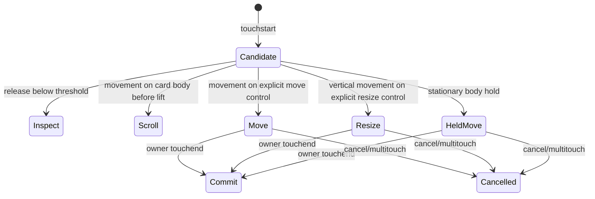

# fix: Make Timeline touch manipulation deterministic

## Summary

Give mobile Event and scheduled Action cards explicit, visible move and resize ownership so direct manipulation starts from deliberate movement instead of a hidden stationary hold. Preserve ordinary Timeline scrolling from non-control card regions, tap-to-inspect, Action completion, JOIN, desktop mouse/pen behavior, recurrence, persistence, and lane layout.

## Problem Frame

The current Day Timeline implements two conflicting touch contracts on the same pixels. Card bodies and Event resize controls declare `touch-action: pan-y` and arm a 300ms hold. Meaningful movement before the timer matures cancels manipulation and gives the browser the Timeline scroll. When the timer matures, JavaScript acquires a scroll lock and starts moving or resizing. A small drift before 300ms therefore changes the outcome from manipulation to scrolling, while a scroll that begins near the lift boundary can visibly compete with the active card until the lock restores the stream.

The visible Event controls introduced in the previous correction still require the hidden hold, and the Action move face has no separate coarse-pointer move owner. Automated tests encode those waits, so they prove eventual capability rather than a natural first attempt.

## Requirements

- R1. A visible Event move control must start Event movement after a small deliberate touch displacement, without a 300ms hold.
- R2. Visible Event start/end controls must start their matching resize after deliberate vertical touch displacement, without a hold.
- R3. A visible scheduled Action move control must start Action movement after deliberate touch displacement, without a hold.
- R4. The visible estimated-Action resize control must start resize after deliberate vertical displacement, without a hold.
- R5. Direct controls must declare browser ownership at touch start so the Day stream cannot pan underneath an active move or resize.
- R6. Touches outside direct controls retain the current scroll-safe card-body contract: tap inspects; movement before lift scrolls; stationary hold may still move for backward compatibility.
- R7. A tap or 1–2px tremor on any direct control remains a click candidate and opens the matching inspector.
- R8. Explicit ownership precedence remains completion/JOIN, then resize, then move, then card body, then empty Timeline.
- R9. Event move preserves duration and date for same-Day moves. Event start resize preserves end; Event end resize preserves start. Action move preserves date/estimate; Action resize preserves date/start.
- R10. Cancellation and multi-touch write nothing, release scroll ownership, remove active styling, and leave the next gesture usable.
- R11. Controls use at least 44px coarse-pointer targets, remain visually legible, do not overlap each other or JOIN/completion, and do not hide the title on eligible cards.
- R12. Desktop direct drag/resize, recurrence scope, Action completion swipe, ANY TIME, Timeline chrome, navigation, and motion remain unchanged.

## Key Technical Decisions

1. Add a semantic `data-touch-move` role to the existing touch-target classifier rather than creating another gesture state machine. The delegated Day-stream listener remains the sole touch lifecycle owner.
2. Direct controls use static `touch-action: none`; non-control card regions keep `pan-y`. Browser arbitration is therefore decided before the gesture begins instead of being fought after a 300ms timer.
3. Direct manipulation still activates from a small movement threshold, not on touch contact. This preserves tap-to-inspect and tremor safety.
4. Reuse the existing interaction records, `gestureRef`, `activateWithMovement`, `applyRef`, scroll-lock helper, snapping, minimum-duration logic, and commit paths. The movement that crosses the threshold must also apply the current coordinates on that same frame.
5. The direct move target occupies its own 44px lane. Event resize eligibility must reserve start, move, readable body, end, and optional JOIN lanes. Action geometry must reserve completion, move, readable title, and optional estimate lanes.

## High-Level Technical Design

## Scope Boundaries

In scope: Day Timeline Event and scheduled Action touch target geometry, target classification, delegated touch activation, real-touch browser contracts, interaction documentation, and QA evidence.

Out of scope: Week gesture redesign, empty-space creation, domain APIs, persistence schema, navigation/ribbon/motion, recurrence semantics, lane-packing algorithms, snapping changes, new dependencies, or React per-frame state. A narrow visual-footprint input to the existing packer is allowed only to keep the new 44px Action minimum from overlapping a neighboring short Action; stored duration and packing mechanics remain unchanged.

## Implementation Units

### U1. Characterize direct-control touch intent

**Goal:** Add regression coverage that fails because current visible controls still depend on the 300ms hold and because no explicit move role exists.

**Requirements:** R1–R11

**Dependencies:** none

**Files:**

- `src/features/planner/timelineTouchTarget.test.js`
- `tests/e2e/timeline-touch.spec.js`
- `tests/e2e/actions.spec.js`
- `tests/e2e/interaction-contracts.spec.js`

**Approach:** Extend the pure target contract for explicit move ownership and add real CDP touch tests with no down-to-move delay. Assert stored model invariants, stream scroll stability, tap/tremor behavior, computed `touch-action`, 44px geometry, and point-grid non-overlap. Keep existing body-scroll tests to protect the separate scroll-safe region.

**Execution note:** Observe RED on the exact branch base before production modification.

**Test scenarios:**

1. Event move control receives touchstart then immediate threshold-crossing move; Event moves, duration/date remain, and stream scrollTop is unchanged.
2. Event start and end controls immediately resize the intended boundary, preserve the opposite boundary, and do not scroll the stream.
3. Scheduled Action move control immediately moves startMinute while preserving date/estimate and stream scrollTop.
4. Action estimate control immediately resizes estimate while preserving date/start and stream scrollTop.
5. A tap and 2px tremor on direct controls open the inspector without writes.
6. A touch beginning outside direct controls physically scrolls the stream and does not mutate or inspect the card.
7. Element-from-point checks prove controls are visible, at least 44px, and disjoint from resize/JOIN/completion owners.

**Verification:** New immediate-control cases fail against the base for the intended hold/role reason; existing body-scroll cases remain green.

### U2. Implement explicit Event and Action touch ownership

**Goal:** Make direct controls deterministic while retaining scroll-safe body regions and existing logical gesture machinery.

**Requirements:** R1–R12

**Dependencies:** U1

**Files:**

- `src/Planner.jsx`
- `src/features/planner/TimelineEventResizeControls.jsx`
- `src/features/planner/TimelineActionCard.jsx`
- `src/features/planner/timelineTouchTarget.js`
- `src/features/planner/timelineTouchTarget.test.js`
- `tests/e2e/timeline-touch.spec.js`
- `tests/e2e/actions.spec.js`
- `tests/e2e/interaction-contracts.spec.js`

**Approach:** Add visible semantic move targets, make direct controls browser-owned from touch start, and activate existing move/resize gestures on threshold movement with same-frame pointer application. Keep long-hold behavior only for ordinary card body/empty-space paths. Update width gates and padding so move, readable content, resize, JOIN, and completion lanes do not collide.

When a short scheduled Action renders at the 44px coarse-pointer minimum, feed
that same minimum visual footprint into the existing lane packer and restore
the real estimate immediately afterward. This prevents visual overlap without
changing the stored estimate, live-time calculation, snapping, or packing
algorithm.

**Patterns to follow:** Existing `classifyTimelineTouchTarget`, `interactionRef`, `gestureRef`, `activateWithMovement`, `beginResizeRef`, `applyRef`, and `timelineTouchScrollLockRef` paths.

**Test scenarios:** U1 scenarios become green; cancellation, second-touch, Action completion, JOIN, desktop resize, desktop move, and remount tests stay green.

**Verification:** Direct controls never depend on `LIFT_MS`; non-control body areas still allow physical Timeline scrolling; no domain or motion file changes.

### U3. Record product and regression evidence

**Goal:** Make the new interaction grammar durable and honestly scoped.

**Requirements:** R1–R12

**Dependencies:** U2

**Files:**

- `docs/interaction-contracts/planner-interactions.md`
- `docs/qa/2026-08-23-timeline-touch-direct-manipulation.md`

**Approach:** Document the explicit-control versus scroll-safe-body distinction, RED/GREEN evidence, Windows Chrome findings, automated counts, negative controls, affected dependencies, and physical-device limitations.

**Test expectation:** none — documentation records independently verified implementation evidence.

**Verification:** QA claims match exact commands and environment; Android/iOS physical-device status is not overstated.

## Verification Contract

- Pure gesture/target and interaction-state units pass.
- Immediate Event/Action move and resize cases pass three consecutive times with real CDP touch input.
- Complete Timeline touch, Actions, gesture-isolation, interaction-contract, recurring, JOIN, Timeline chrome, and navigation suites pass.
- `npm test`, production build, and full Chromium Playwright pass, or every residual is compared against the exact base in the same environment.
- Windows Chrome product review covers 1280x900, 390x844, and 390x601, including repeated human-speed direct-control attempts and body scrolling.
- A local negative control that restores hold-only direct controls makes the immediate regression cases fail, then restored implementation passes.

## Definition of Done

- Direct Event and Action move/resize targets respond consistently without a stationary hold.
- The Timeline cannot move under an active explicit-control gesture.
- Ordinary Timeline scrolling remains available outside the controls.
- Every operation persists only its intended fields and cancellation writes nothing.
- Visual ownership is legible and non-overlapping at both mobile heights and desktop.
- Adjacent gesture, recurrence, JOIN, Timeline chrome, ANY TIME, navigation, and motion behavior remain unchanged.
- Verification and Windows Chrome evidence are recorded, committed, rebased on current main, and pushed to `main` only after final review.
