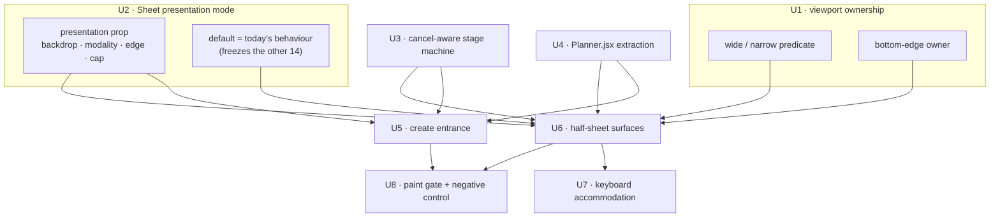

# Sheet Presentation Physicality - Plan

## Goal Capsule

- **Objective.** Give the create and edit surfaces an entrance that comes from the thing the person touched, so the planner reads as one physical object rather than a page that summons modals.
- **Product authority.** This plan owns the *presentation* of four sheet consumers: the composer, the record inspector, Settings, and the palette. It does not own their content, their commands, or their persistence.
- **Open blockers.** None at the requirement level. One sequencing constraint is live and is not this plan's to resolve: `src/Planner.jsx` sits one line under its ratchet, and `src/features/motion/plannerStyles.js` currently carries another branch's uncommitted edits.

---

## Product Contract

### Summary

Two entrances replace one generic animation. The `NEW` and `+ ACTION` controls grow into the composer out of their own bounds — the control becomes the panel. Tapping an Event or Action card instead opens a half-sheet beside the record: a right-hand panel on wide viewports, a bottom sheet on narrow ones, with the timeline staying visible and shifting to make room. Settings and the palette adopt the same half-sheet geometry, so the four surfaces this plan owns follow two rules and the remaining fourteen keep the default.

### Problem Frame

The app already contains the mechanism this asks for. `src/features/motion/Sheet.jsx` implements a `morph="notch"` mode that opens a panel's clip-path outward from a captured trigger rect, complete with a reverse path that folds an interrupted entrance back into its origin instead of restarting it.

It is wired to almost nothing. Of the eighteen `Sheet` consumers in `src/Planner.jsx`, three create paths pass a morph source: the `NEW` control, the `+ ACTION` control, and one conditional task path. The record inspector — every Event edit and every Action edit, reached from twenty-four call sites — mounts its sheet with no morph prop at all and falls through to the default. Two create paths, the `n` and `a` keyboard shortcuts, pass `morph: "none"` outright because a keystroke has no rect to grow from.

The app also has this rule written down. `PRODUCT.md` states it as principle 5 — "Reveal, do not stretch. A sheet is the same object as its trigger, at true size" — and `DESIGN.md` repeats it. So the gap is not a matter of taste: it is documented doctrine the app follows on three surfaces out of eighteen.

The defect is that entrances are assigned ad hoc rather than by a rule. A person who presses `NEW` sees the button become the panel; the same person tapping the event they just created sees a panel fade in from nowhere, and neither outcome follows from anything a contributor could look up. Success for this plan is that every governed surface's entrance is derivable from which act it is — create or edit — not that all surfaces share one entrance.

### Key Decisions

- **Two presentation rules, not one.** Create is *made of* its trigger; edit arrives *beside* its record. (session-settled: user-directed — chosen over extending one unified morph to every surface: create and edit are different acts and should not share an entrance.) Governs R1, R5.
- **The entrance follows from the act, not from the surface.** A surface opened from a create control uses the create entrance; a surface opened by touching an existing record uses the half-sheet; a surface this plan does not govern keeps the default. The governed set is derived from that criterion rather than enumerated ahead of it, so the next sheet added to the app has a rule to apply. Governs R1, R5, R7, R8.
- **This work narrows the app's written sheet doctrine rather than contradicting it.** `PRODUCT.md` principle 5 and the `DESIGN.md` paragraph on sheets growing from their control currently read as universal. After this plan they describe the create entrance specifically, with the half-sheet governing the record inspector, Settings, and the palette. Amending both files is part of this work, not a follow-up. Governs R5, R7, R8.
- **Half-sheet for the record inspector.** The timeline stays on screen and shifts rather than being covered. (session-settled: user-directed — chosen over a full-screen inspector: losing your place in the day is the cost that matters at desktop width.) Governs R5, R6.
- **Match the reference motion with compositor properties.** The transitions.dev plus-to-menu morph animates `width`, `height`, and `border-radius`; this app reproduces the same read using transform and clip-path. (session-settled: user-approved — the codebase already retired a per-frame `clip-path` repaint for being paint-bound, and the phone stutter that motivated it is still unconfirmed.) Governs R11.
- **A create path with no trigger rect uses the half-sheet, and a keystroke gets its shape without its transition.** (session-settled: user-directed — chosen over preserving the `PRODUCT.md` exemption that keyboard and command-palette create do not morph, and over animating the keystroke path: the repo's frequency rule that every keystroke earns zero animation survives intact, while the composer stops having three resting shapes.) Governs R17, extending the same geometry-not-timing split already settled for R8.
- **Sheet geometry is shared; sheet timing is not.** A surface invoked by keystroke does not animate, even when its geometry matches a surface that does. Governs R8.
- **One surface owns the bottom edge of a narrow viewport.** Governs R9, R10.
- **Every create control behaves alike.** `NEW`, `+ ACTION`, and whichever control the Actions panel exposes at the current width share the create entrance. (session-settled: user-directed — chosen over scoping the entrance to the two controls outside the Actions surface: a create control that behaves differently because of where it sits is the inconsistency this work exists to remove.) Governs R1, R9, R15.
- **The navigation shell is untouched.** (session-settled: user-directed.) `Sheet.jsx` holds no call edge into the navigation system, and the two subsystems' styles occupy disjoint namespaces in `src/features/motion/plannerStyles.js` — but that establishes code independence, not geometric independence, and the two do share space. The invariant that makes the decision checkable: the sheet system writes no transform or geometry onto `.nb-nav-motion-carrier` or `.nb-app-surface`, and any timeline displacement R6 requires applies to an element strictly inside the planner surface, so navigation travel and sheet presentation never compose on one node. Governs R6.

### Requirements

**Create entrance — the control becomes the panel**

- R1. Pressing a create control opens the composer as a continuation of that control: the panel is revealed at its true size through a window opening out from the control's bounds, never scaled up from them.
- R2. The control's `+` glyph resolves into a dismiss affordance across the same interval, and the composer's content arrives as a settle rather than a hard cut. Blur is the optional refinement on that settle and is the first thing dropped if it costs frames; the settle itself is required.
- R3. The opened panel's dimensions derive from the viewport at open time. No fixed pixel size survives into the implementation.
- R4. An entrance interrupted before it settles reverses from its rendered position back into the control, rather than restarting or cutting.
- R15. The create controls are `NEW`, `+ ACTION`, and whichever control the Actions panel exposes at the current viewport width. `+ ADD` does not render below the wide breakpoint, so at narrow widths the entrance belongs to the Actions panel's empty-state add control instead.
- R17. A create path carrying no trigger rect — canvas drag, week slot pick, command-palette create, keyboard shortcut, search-to-create — opens the composer as a half-sheet rather than with the create entrance. When the path is a keystroke, the half-sheet's geometry applies but no entrance transition runs. This governs the composer; R8 continues to govern the palette surface itself.

**Edit and secondary surfaces — the panel arrives beside the record**

- R5. Opening an Event or Action card for editing presents a half-sheet: a side panel at wide viewports, a bottom sheet at narrow ones. Its primary axis derives from the viewport at open time with explicit minimum and maximum clamps rather than a bare fraction, and its other axis fills the remaining viewport dimension. No fixed pixel size survives into the implementation.
- R6. The surface the record came from stays visible during and after the transition, and moves to make room rather than being occluded. The record that was opened holds its position relative to the viewport once the panel has settled.
- R7. Settings adopts the same half-sheet geometry as the record inspector.
- R8. The palette adopts the same geometry, but opens without transition when invoked by keystroke. It uses the create entrance only when opened from a visible control by pointer.

**Narrow-viewport surface ownership**

- R9. While the Actions surface owns the full narrow viewport, a sheet opened from within it presents at full size instead of as a bottom sheet. This is the first consumer of the signal in R16, not a special case.
- R10. At any moment on a narrow viewport, exactly one surface owns the bottom edge. A sheet never comes to rest overlapping a surface that already occupies that region.
- R16. The app exposes one readable signal naming which surface currently owns the bottom edge of a narrow viewport, and every narrow-viewport sheet consults it at open time to choose between full-surface and bottom-sheet presentation. Without it R10 is a prohibition with nothing to branch on, which is how the prior overlap defect arose.

**Motion contract**

- R11. Every frame of every entrance and exit is free of layout and of full-subtree repaint. Animated `clip-path` is permitted only on a promoted layer whose clipped subtree is the sheet itself, never an ancestor of the planner surface.
- R12. Under a reduced-motion preference, all four surfaces resolve to an opacity change with no travel, scale, or clip, on both entrance and exit.
- R13. Exits complete faster than their matching entrances.

**Shared component safety**

- R14. The fourteen out-of-scope sheet consumers keep their current backdrop, modality, edge anchoring, and width under the new presentation mode. Introducing the mode changes none of them.

### Key Flows

- F1. Create from a visible control
  - **Trigger:** Person presses `NEW`, `+ ACTION`, or `+ ADD`.
  - **Steps:** The control's bounds are captured; the composer resolves from those bounds to its viewport-derived size; the glyph resolves to a dismiss affordance; content settles in behind it.
  - **Outcome:** The composer is open and the control is no longer separately visible.
  - **Covers R1, R2, R3, R4.**

- F2. Edit a record at wide viewport
  - **Trigger:** Person taps an Event or Action card in the timeline.
  - **Steps:** A side panel enters from the trailing edge; the timeline shifts to make room and remains readable throughout.
  - **Outcome:** The record is editable with its surrounding day still in view.
  - **Covers R5, R6.**

- F3. Edit a record at narrow viewport while Actions owns the view
  - **Trigger:** Person taps an Action from within the Actions surface on a phone.
  - **Steps:** Because the Actions surface owns the viewport, the editor takes full presentation rather than a bottom sheet.
  - **Outcome:** The editor is open with no surface stacked beneath it competing for the bottom edge.
  - **Covers R9, R10.**

### Acceptance Examples

- AE1. **Covers R9, R10.** Given a narrow viewport with the Actions surface showing, when a record is opened for editing, then the editor occupies the full surface and no bottom sheet is presented.
- AE2. **Covers R8.** Given the palette is opened by keystroke, when it appears, then it does so with no entrance transition.
- AE3. **Covers R8.** Given the palette is opened by pointer from a visible control, when it appears, then it uses the create entrance from that control.
- AE4. **Covers R12.** Given a reduced-motion preference, when any of the four surfaces opens or closes, then it changes opacity only and no element travels, scales, or clips.
- AE5. **Covers R4.** Given a create entrance is dismissed before it settles, when the dismissal is received, then the panel returns into the control from wherever it had reached.
- AE6. **Covers R6.** Given a record is opened at wide viewport, when the panel has settled, then the card that was opened is still in view and holds its position — not merely that the timeline is somewhere on screen.

### Scope Boundaries

- The navigation shell — drawer, rail, masks, and travel — is untouched. Nothing in this plan reads or writes navigation state or styles.
- Fourteen of the eighteen `Sheet` consumers keep their current presentation: day peek, unsaved-changes, plan, still-blocked, welcome, move-to-list, dependency picker, list manager, repeating-item scope, note, notebook, history, missed-report, and shortcuts.
- Day peek and note editing are opened by touching a record and would qualify for the half-sheet under the entrance criterion, but stay excluded: they are notebook surfaces rather than the planner's create-and-edit path. Naming the exception keeps the criterion honest; widening scope to them is a separate decision.
- `PRODUCT.md` principle 5, its exemption stating that keyboard and command-palette create do not morph, and the `DESIGN.md` paragraph on sheets growing from their control are amended by this work to describe two entrances rather than one. Amending those passages is in scope; rewriting the rest of either document is not.
- Sheet content, commands, validation, and persistence are unchanged. This plan governs how these surfaces arrive and leave, nothing else.
- Timeline drag, event resize, action drag, and mobile touch ownership stay closed.
- The unconfirmed navigation repaint defect on physical devices is not addressed here and is not a gate on this work.

### Dependencies and Assumptions

- `src/Planner.jsx` is one line below its enforced ceiling, so this work cannot add a line to that file without first extracting from it. The extraction is a precondition, not an optional cleanup, and the ceiling constant is not to be raised. It is capped at the minimum needed to clear the ceiling for this plan's own diff, and the extracted code lands within existing module boundaries per `docs/adr/0001-domain-oriented-modular-monolith.md`. Refactoring unrelated `Planner.jsx` logic is not authorised by this plan.
- This work edits `src/Planner.jsx` and `src/features/motion/plannerStyles.js`, both of which see frequent concurrent work on other branches. Confirm both are clean before starting and rebase onto current `main` rather than building into an in-flight tree.
- The morph machinery is reusable but not clean. The 2026-08-23 headless capture recorded the sheet morph at worst 50.0ms with 3 frames over 33ms — the only surface in that session to drop frames, and the control that proved the recorder could detect jank at all. This plan extends its coverage on the assumption that the recorded cost is per-open and does not compound with the number of wired consumers. R11 exists because that assumption is unverified.
- `src/features/motion/Sheet.jsx` must gain an explicit per-consumer presentation mode covering backdrop, modality (`aria-modal` and the focus trap), edge anchoring, and width cap. Its presentation is currently global: every consumer renders behind one full-viewport backdrop at 72% black and is capped at a single fixed panel width. R6 cannot hold while that backdrop covers the timeline, and R3 cannot hold while that width cap survives, so this is required work rather than an extension of existing coverage.
- The morph geometry in `src/features/motion/fluidGeometry.js` and the trigger capture in `src/features/motion/fluidTrigger.js` are reused unchanged.
- Sheets render inside the navigation's `.nb-nav-carrier.nb-nav-motion-carrier`, which holds a transform at rest. A transformed ancestor is the containing block for `position: fixed` descendants, so a sheet's fixed box resolves to that carrier rather than to the viewport. The half-sheet's edge anchoring and size must be specified against the carrier box in both the drawer-closed and drawer-open states.
- A prior defect placed a sheet in overlap with the Actions surface at narrow viewport when that surface owned the view. R9 and R10 exist to prevent its return.

### Outstanding Questions

**Deferred to planning**

- R-Q1. Where the extraction boundary falls in `src/Planner.jsx`, within the cap named in Dependencies.
- R-Q3. Whether the side panel at wide viewport shifts the timeline or overlays a narrowed one. Both arms are constrained by R11: a shift must be a transform on an already-promoted element, and any resolution requiring per-frame width, margin, or grid-track interpolation is out of contract. The one in-repo precedent for making room animates grid columns, which R11 forbids.
- R-Q4. What the half-sheet does when the on-screen keyboard opens at narrow viewport — whether it inherits the composer's freeze-height-at-open behaviour or repositions so the focused field stays above the keyboard.
- R-Q5. Whether the narrow-viewport bottom sheet supports swipe-to-dismiss, in addition to the backdrop tap and Escape the component already implements.
- R-Q6. Which entrance governs the composer's EDIT state when reached from the record inspector's handoff, since it carries an existing record and no trigger rect and fits neither rule as written.

### Sources

- `src/features/motion/Sheet.jsx` — the existing morph implementation, its stage machine, and its interrupt-reverse path.
- `src/features/motion/fluidGeometry.js`, `src/features/motion/fluidTrigger.js` — trigger rect capture and morph geometry.
- `src/features/planner/ActionsPanel.jsx` — the Actions surface and its create control.
- `src/features/motion/plannerStyles.js` — the disjoint namespaces separating navigation styles from sheet keyframes.
- `src/architecture.test.js` — the enforced ceiling on `src/Planner.jsx`.
- `docs/adr/0001-domain-oriented-modular-monolith.md` — module boundaries the extraction must respect.
- `PRODUCT.md`, `DESIGN.md` — the written sheet doctrine this work narrows and amends.
- `docs/plans/2026-08-23-001-fix-navigation-shell-clip-path-repaint-plan.md` — the frame capture recording the sheet morph's worst frame.
- `.agents/memory/sheet-motion-scheduling.md` — the prior stutter caused by scheduling layout against a running morph.
- `docs/plans/2026-08-17-002-refactor-defade-motion-plan.md` — the frequency rule that a keystroke earns zero animation.
- `docs/plans/2026-08-20-004-feat-anchored-notch-morph-v2-plan.md`, `docs/plans/2026-08-21-001-feat-new-morph-v3-transitions-perceptual-match-plan.md` — the morph architecture in force and the choreography that superseded it.

---

## Planning Contract

**Product Contract preservation.** Unchanged except R17, which gained a keystroke-timing clause from a decision settled during planning. No R-ID was split, renumbered, or re-scoped.

### Key Technical Decisions

- KTD1. **Presentation becomes an explicit prop contract on `Sheet`, defaulting to today's behaviour.** The component gains `presentation` covering backdrop, modality, edge anchoring, and size cap. Omitting the prop yields exactly the current scrim, `aria-modal`, centering, and `sm:max-w-md`, so the fourteen frozen consumers need no edit at all. Governs R5, R7, R14.
- KTD2. **Making room is a transform on the displaced column, never a track or width animation.** Reuses the `translate3d(100%,0,0)` plus delayed-`visibility` pattern already shipped on `.nb-actions-column` in `src/features/motion/plannerStyles.js`. Resolves R-Q3; governs R6, R11.
- KTD3. **The stage machine becomes cancel-aware.** Today it is bare `setTimeout` that cancels nothing, which is the named cause of the currently-red stalled-animation test and sits directly under the interrupt-reverse path. Extending morph coverage to roughly twenty-four more call sites without this multiplies a known failure. Governs R4, R13.
- KTD4. **One module owns viewport ownership.** It exports the wide/narrow predicate and the bottom-edge-owner signal, replacing the raw `"(max-width: 639.98px)"` string currently re-declared in four places. Governs R5, R9, R10, R16.
- KTD5. **Keyboard accommodation reads `visualViewport` and writes only a transform.** `interactive-widget` is Chromium-only, the VirtualKeyboard API has unfixed height and coordinate bugs, and `dvh`/`svh`/`lvh` do not respond to the keyboard at all. The delta lands in a custom property consumed solely by `translateY`, never by height, padding, or inset. Resolves R-Q4.
- KTD6. **Repaint absence is proven in CI through the layer tree, not inferred.** A `CDPSession` enables `LayerTree` and asserts no `layerPainted` fires for the animating layer across an entrance. The check is only trusted once a deliberately layout-triggering control has been watched to fail it. Governs R11.
- KTD7. **A keystroke gets the half-sheet's geometry without its transition.** (session-settled: user-directed — chosen over animating keyboard create: preserves the repo's frequency rule while removing the composer's third resting shape.) Governs R17.
- KTD8. **The extraction is sized by the ceiling, not by tidiness.** It moves the smallest coherent unit that clears headroom for this plan's own diff and lands within existing module boundaries. Resolves R-Q1.

### High-Level Technical Design

The ordering constraint that matters: U2 and U3 both reshape the component every governed surface flows through, and U4 buys the line budget the rest need. Nothing user-visible lands until those three are in.

### Assumptions

- The sheet morph's measured 50.0ms worst frame is per-open and does not compound with the number of wired consumers. U8 exists because this is unverified.
- `LayerTree.layerPainted` fires for a layout-triggering animation in this repo's CI environment. U8's negative control proves or disproves it before any positive result is trusted.

---

## Implementation Units

### U1. Viewport ownership signals

- **Goal.** One module owns the wide/narrow predicate and the bottom-edge-owner signal.
- **Requirements.** R5, R9, R10, R16.
- **Dependencies.** None.
- **Files.** `src/features/motion/viewportOwnership.js`, `src/features/motion/viewportOwnership.test.js`, and the four existing raw-string sites: `src/features/motion/viewPills.js`, `src/Planner.jsx`, `src/features/motion/useNavigationMotion.js`, `src/features/planner/gooey.jsx`.
- **Approach.** Export the predicate and the owner signal; migrate the four call sites to import rather than re-declare `"(max-width: 639.98px)"`. Preserve the `639.98` value and the reason it is not `640`.
- **Patterns to follow.** `src/features/motion/viewPills.js` for the constant and its boundary-pixel comment.
- **Test scenarios.**
  - The predicate reports narrow at 639.98px and wide at 640px, matching the existing constant's boundary.
  - The bottom-edge owner reports the Actions surface while it owns the narrow viewport, and reports none otherwise.
  - Two surfaces cannot both claim the bottom edge; the second claim is rejected rather than overwriting.
- **Verification.** `npm test` passes and no source file outside this module still contains the raw media-query string.

### U2. Sheet per-consumer presentation mode

- **Goal.** `Sheet` accepts an explicit presentation contract; omitting it reproduces today's behaviour byte for byte.
- **Requirements.** R5, R7, R14.
- **Dependencies.** None.
- **Files.** `src/features/motion/Sheet.jsx`, `tests/e2e/motion.spec.js`.
- **Approach.**
  1. Add a `presentation` prop covering backdrop opacity and presence, modality (`aria-modal` and focus trap), edge anchoring, and size cap.
  2. Default it to the current hardcoded values so the fourteen out-of-scope consumers are untouched.
  3. Keep the scrim's dismissal guard, body-scroll lock, focus restoration, and `88svh` cap intact under every mode.
- **Execution note.** Land the default-preserving refactor and prove the fourteen are unchanged before any new mode is introduced.
- **Patterns to follow.** The existing prop-with-safe-default shape of `morph = "auto"` in the same file.
- **Test scenarios.**
  - Covers R14. Each of the fourteen out-of-scope consumers renders with the same backdrop opacity, modality attributes, anchoring, and width as before the change.
  - A consumer passing a side-anchored presentation renders against the trailing edge without a full-cover backdrop.
  - Focus is trapped and restored identically under both the default and the new modes.
  - Escape and backdrop dismissal behave the same under every mode.
- **Verification.** The fourteen consumers show no visual or attribute diff; the contact sheet is unchanged for their surfaces.

### U3. Cancel-aware stage machine

- **Goal.** Stage transitions cancel cleanly when a sheet closes or reopens mid-flight.
- **Requirements.** R4, R13.
- **Dependencies.** U2.
- **Files.** `src/features/motion/Sheet.jsx`, `src/features/motion/morphTiming.js`, `tests/e2e/motion.spec.js`.
- **Approach.** Replace the bare `setTimeout` choreography with timers that are cancelled on close, on reopen, and on unmount, and cancel any animation still present in `getAnimations()` when the stage the machine believes it reached is opened.
- **Execution note.** Start from the currently-red stalled-animation test; it is the characterization this unit exists to satisfy.
- **Test scenarios.**
  - A stalled entry animation is cancelled once the stage machine opens the stage, and no longer appears in `getAnimations()`.
  - Closing at 30% of an entrance reverses from the rendered position rather than restarting.
  - A close immediately followed by a reopen leaves exactly one settled sheet with no orphaned timers.
  - Unmounting mid-entrance leaves no pending timer that fires against a detached node.
- **Verification.** `tests/e2e/motion.spec.js` passes including the previously-red stalled-animation case, on the Chromium build in use.

### U4. Extraction to clear the Planner ceiling

- **Goal.** Free enough line budget in `src/Planner.jsx` for the units that follow.
- **Requirements.** Enables R1, R5, R9, R17.
- **Dependencies.** None.
- **Files.** `src/Planner.jsx`, `src/architecture.test.js`, plus the destination module chosen within existing boundaries.
- **Approach.** Move the smallest coherent unit that clears headroom for this plan's own diff. Lower `PLANNER_CEILING` in the same commit to the new true count. Do not raise it, and do not refactor unrelated logic.
- **Patterns to follow.** `docs/adr/0001-domain-oriented-modular-monolith.md` for where extracted code may live; the wiring ratchet in `src/architecture.test.js` requires the new module be imported from outside its own folder.
- **Test scenarios.**
  - Covers the size ratchet. `src/Planner.jsx` is below the lowered ceiling and the ceiling matches the new true count.
  - The wiring ratchet passes: the destination module is imported from outside its folder.
  - The scope ratchet passes: the extracted code imports every binding it uses rather than inheriting one from `Planner.jsx`.
- **Verification.** `npm test` passes with the lowered ceiling committed alongside the move.

### U5. Create entrance across every create control

- **Goal.** Every create control reveals the composer at true size from its own bounds.
- **Requirements.** R1, R2, R3, R4, R15.
- **Dependencies.** U2, U3, U4.
- **Files.** `src/Planner.jsx`, `src/features/planner/ActionsPanel.jsx`, `src/features/motion/fluidGeometry.js`, `tests/e2e/motion.spec.js`, `tests/e2e/composer.spec.js`.
- **Approach.**
  1. Wire the Actions panel's empty-state add control with a morph source, so a narrow viewport has a create control that carries the entrance.
  2. Derive panel size from the viewport at open time; remove the fixed cap for this surface.
  3. Keep blur as an optional refinement on the content settle, droppable without removing the settle.
- **Patterns to follow.** The existing `morphSource` shape passed by `NEW` and `+ ACTION` in `src/Planner.jsx`.
- **Test scenarios.**
  - Covers R1. Pressing each create control opens the composer with a clip-path window growing from that control's measured rect, with the panel's layout box unchanged at every sampled frame.
  - Covers R15. At narrow width, the Actions panel's reachable create control carries the entrance; `+ ADD` is absent there and is not required to.
  - Covers R3. The opened panel's dimensions differ between two viewport sizes; no fixed pixel width appears in the computed style.
  - Covers R4, AE5. Dismissal at 40% reverses into the control rather than restarting.
  - Blur removed from the settle leaves the entrance still correct, proving it is optional.
- **Verification.** Frame-scrubbed samples show the layout box constant; the composer's rendered width tracks viewport width.

### U6. Half-sheet for inspector, Settings, palette, and rect-less create

- **Goal.** Edit and secondary surfaces arrive beside their content rather than over it.
- **Requirements.** R5, R6, R7, R8, R17.
- **Dependencies.** U1, U2, U3, U4.
- **Files.** `src/Planner.jsx`, `src/features/motion/plannerStyles.js`, `tests/e2e/motion.spec.js`, `tests/e2e/composer.spec.js`.
- **Approach.**
  1. Mount the inspector, Settings, and palette with a half-sheet presentation: side panel when wide, bottom sheet when narrow, sized from the viewport with clamps.
  2. Displace the timeline by transform on the column, with `visibility` and `pointer-events` following the settle — never by animating a grid track or width.
  3. Route rect-less create paths to the same geometry; suppress the transition when the path is a keystroke.
  4. Keep the displaced element strictly inside the planner surface so nothing composes with the navigation carrier.
- **Execution note.** Follow the recorded sequence — measure, animate entry, take a final unanimated measure, then enable resize observation. Do not let a live resize source write geometry while the entrance is running.
- **Patterns to follow.** `.nb-actions-column` in `src/features/motion/plannerStyles.js` for transform-plus-delayed-visibility.
- **Test scenarios.**
  - Covers R6, AE6. Opening a record at wide viewport leaves the originating card in view and in the same viewport-relative position after settle.
  - Covers R5. The half-sheet's primary axis changes with viewport size and stays within its clamps at both extremes.
  - Covers R8, AE2, AE3. The palette opens with no transition from a keystroke and with the create entrance from a pointer control.
  - Covers R17. A canvas-drag create opens the half-sheet; an `n` keystroke opens the same geometry with no entrance animation.
  - The navigation carrier and app surface carry no transform written by the sheet system, in both drawer states.
  - No `grid-template-columns` or width transition appears on the displaced column.
- **Verification.** The timeline remains visible and positionally stable through the transition; the layout box of both panel and column is constant at every sampled frame.

### U7. Keyboard-aware half-sheet

- **Goal.** A focused field inside a narrow-viewport half-sheet stays visible when the on-screen keyboard opens.
- **Requirements.** R5, R6.
- **Dependencies.** U6.
- **Files.** `index.html`, `src/features/motion/Sheet.jsx`, `src/features/motion/plannerStyles.js`, `tests/e2e/mobile.spec.js`.
- **Approach.** Set `interactive-widget=overlays-content`, observe `visualViewport` resize and scroll, and write the delta to a custom property consumed only by `transform: translateY()`. Never bind height, padding, or inset to keyboard state. Re-sync on the resize that reports height returning to full rather than assuming a single snapshot.
- **Execution note.** Hold the sheet's box static; if the keyboard opens during an entrance, re-sync on the next resize rather than fighting the running transition.
- **Test scenarios.**
  - With the keyboard shown, the focused field's rect sits above the keyboard inset.
  - The sheet's own height is unchanged between keyboard-hidden and keyboard-shown states.
  - After dismissal, the sheet returns to its resting offset even when the reported viewport offset does not reset to zero.
  - A keyboard opening mid-entrance does not restart or stutter the entrance.
- **Verification.** Only `transform` differs between keyboard states; no layout property changes.

### U8. Motion-contract verification harness

- **Goal.** R11 becomes a gate that can fail, not an assertion that passes by default.
- **Requirements.** R11, R12, R13.
- **Dependencies.** U5, U6.
- **Files.** `tests/e2e/motion.spec.js`, `tests/e2e/helpers.js`.
- **Approach.** Open a `CDPSession`, enable `LayerTree`, and assert no `layerPainted` fires for the animating layer across each governed entrance. Pair every assertion with a control that animates a layout-triggering property and must be observed to fail.
- **Execution note.** Write the failing control first. A negative result from this harness means nothing until the harness has been watched to go red.
- **Patterns to follow.** The existing scrub idiom in `tests/e2e/motion.spec.js` — pause, set `currentTime`, sample, play.
- **Test scenarios.**
  - Covers R11. No `layerPainted` fires for the sheet's layer during any of the four governed entrances.
  - The negative control animating a layout property does fire `layerPainted`, proving the check is live.
  - Covers R12, AE4. Under reduced motion, each surface changes opacity only, on both entrance and exit.
  - Covers R13. Each exit's measured duration is shorter than its matching entrance.
- **Verification.** The control fails when expected and passes when reverted; the four entrances stay clean.

### U9. Doctrine amendment

- **Goal.** The written rule matches the shipped behaviour.
- **Requirements.** Supports R5, R7, R8, R17.
- **Dependencies.** U5, U6.
- **Files.** `PRODUCT.md`, `DESIGN.md`.
- **Approach.** Narrow principle 5 and the sheets-grow-from-their-control paragraph to describe the create entrance specifically, record the half-sheet as the rule for the record inspector, Settings, and the palette, and amend the create exemption to say a keystroke keeps the geometry without the transition. Change nothing else in either file.
- **Test scenarios.** Test expectation: none — documentation only, no behavioural change.
- **Verification.** No passage in either file still states a universal rule the code no longer follows.

---

## Verification Contract

| Gate | Command | Applies to | Done signal |
| --- | --- | --- | --- |
| Unit suite | `npm test` | U1, U2, U4 | All pass; ceiling lowered in the same commit as U4 |
| Build | `npm run build` | all | Succeeds |
| Motion suite | `npx playwright test tests/e2e/motion.spec.js` | U3, U5, U6, U8 | Passes, including the previously-red stalled-animation case |
| Composer suite | `npx playwright test tests/e2e/composer.spec.js` | U5, U6 | Passes |
| Paint gate | `npx playwright test tests/e2e/motion.spec.js -g "layer"` | U8 | Control observed red, then green when reverted |
| Contact sheet | `node scripts/contact-sheet.mjs` | U5, U6 | Regenerated and diffed against the pre-change run |

Run Playwright at the repo's configured single worker. Do not override it; the suite samples in-flight frames and is sensitive to CPU contention.

## Definition of Done

- Every create control reveals the composer from its own bounds at true size, including the one reachable at narrow width.
- The record inspector, Settings, and the palette arrive as half-sheets with the originating content still visible and positionally stable.
- A keystroke opens the composer's half-sheet geometry with no entrance animation.
- Exactly one surface owns the bottom edge of a narrow viewport, chosen from a signal rather than a special case.
- The fourteen out-of-scope sheet consumers are byte-identical in backdrop, modality, anchoring, and width.
- The navigation shell carries no transform or geometry written by the sheet system, in either drawer state.
- The paint gate has been watched to fail against a deliberate control and then to pass.
- `PRODUCT.md` and `DESIGN.md` describe the behaviour that shipped.
